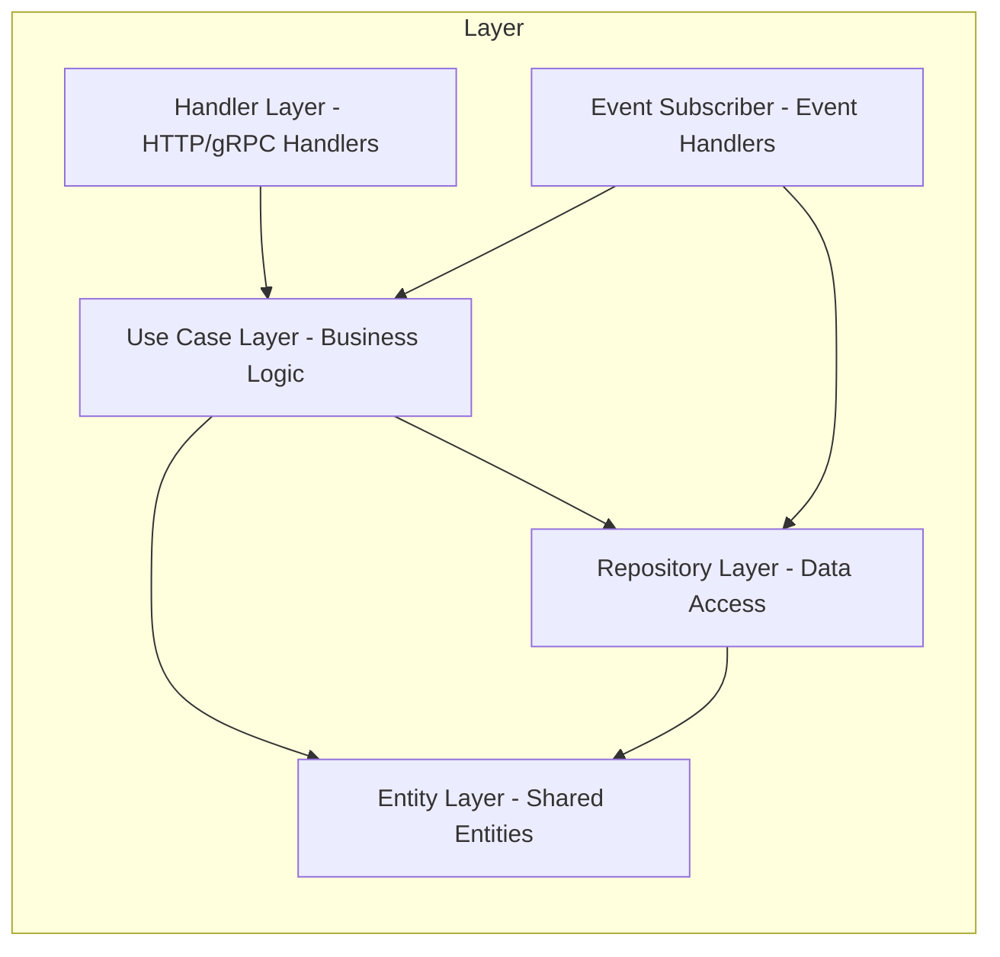
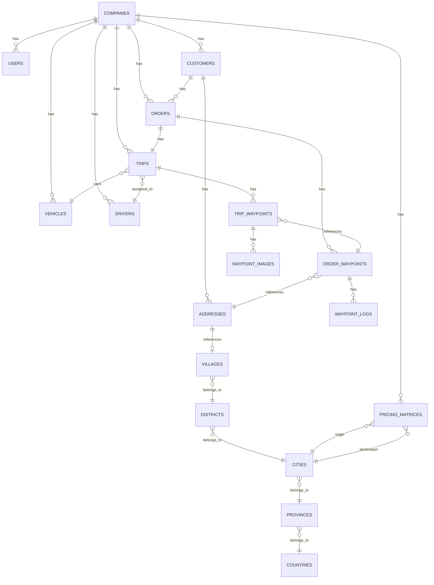

# Blueprint TMS SAAS

## Ringkasan

**Nama Proyek:** Transportation Management System (TMS) SAAS
**Target Pengguna:** Perusahaan Logistik Kecil (3PL & Carrier)
**Arsitektur:** Monolith dengan Multi-tenant Support
**Tech Stack:** Golang (Backend), React + Vite + Redux Toolkit (Frontend), PostgreSQL (Database), MongoDB (Audit Log), Redis (Cache)

---

## 1. Arsitektur Sistem

### 1.1 High-Level Architecture

```mermaid
graph TB
    subgraph Frontend
        A[Web App - React + Vite]
        A1[Admin/Dispatcher Platform]
        A2[Driver Mobile Platform]
        A3[Auth Platform]
    end

    subgraph Backend
        D[API Gateway]
        E[Auth Service]
        F[Company Service]
        G[User Service]
        H[Master Data Service]
        I[Order Service]
        J[Trip Service]
        ~~K[Notification Service]~~
        L[Report Service]
    end

    subgraph Databases
        N[(PostgreSQL)]
        O[(MongoDB)]
        P[(Redis)]
    end

    subgraph External
        Q[SMTP Server]
    end

    A --> D
    D --> E
    D --> F
    D --> G
    D --> H
    D --> I
    D --> J
    ~~D --> K~~
    D --> L

    E --> N
    F --> N
    G --> N
    H --> N
    I --> N
    J --> N
    ~~K --> N~~
    L --> N

    I --> O
    J --> O

    E --> P
    F --> P
    G --> P
    H --> P
    I --> P
    J --> P

    ~~K --> Q~~
```

### 1.2 Backend Architecture (Practical Clean Architecture)



**Architecture Pattern:**

- **Entity Layer** ([`entity/`](entity/)) - Shared data structures and models used across the application
- **Handler Layer** ([`src/handler/rest/`](src/handler/rest/)) - HTTP/gRPC handlers organized by business domain (auth, company, user, order, trip, etc.)
- **Use Case Layer** ([`src/usecase/`](src/usecase/)) - Business logic and orchestration layer
- **Repository Layer** ([`src/repository/`](src/repository/)) - Data access abstraction for PostgreSQL, MongoDB, Redis
- **Event Subscriber** ([`src/event/subscriber/`](src/event/subscriber/)) - Message queue event handlers for async operations

**Key Components:**

- [`main.go`](main.go) - Application entry point with REST/gRPC server initialization
- [`src/handler.go`](src/handler.go) - Route registration for REST and gRPC
- [`src/permission.go`](src/permission.go) - Permission registration for RBAC
- [`src/subscriber.go`](src/subscriber.go) - Event subscriber registration
- [`engine/`](engine/) - Shared engine library for database, cache, broker, transport, and logging

### 1.3 Directory Structure

#### Backend Directory Structure

```
backend/
├── Dockerfile
├── Makefile
├── entity/
├── go.mod
├── go.sum
├── main.go
├── migrations/
├── src/
│   ├── event/
│   │   ├── publisher/
│   │   └── subscriber/
│   ├── handler/
│   │   └── rest/
│   ├── repository/
│   ├── usecase/
│   ├── handler.go
│   ├── permission.go
│   └── subscriber.go
└── utility/
```

**Catatan:** Semua file source code harus mengikuti struktur yang berada di `example/api`.

---

## 2. Database Schema Design

### 2.1 ER Diagram



### 2.2 Table Definitions

#### 2.2.0 Location Reference Tables (Global Data)

**countries**

```sql
CREATE TABLE countries (
    id UUID PRIMARY KEY DEFAULT gen_random_uuid(),
    code VARCHAR(2) UNIQUE NOT NULL,  -- ID, e.g., ID
    name VARCHAR(100) NOT NULL,
    created_at TIMESTAMP DEFAULT NOW(),
    updated_at TIMESTAMP DEFAULT NOW()
);
```

**provinces**

```sql
CREATE TABLE provinces (
    id UUID PRIMARY KEY DEFAULT gen_random_uuid(),
    country_id UUID NOT NULL REFERENCES countries(id),
    code VARCHAR(10) UNIQUE NOT NULL,  -- BPS code, e.g., 11, 31, 32
    name VARCHAR(100) NOT NULL,
    created_at TIMESTAMP DEFAULT NOW(),
    updated_at TIMESTAMP DEFAULT NOW()
);

CREATE INDEX idx_provinces_country ON provinces(country_id);
```

**cities**

```sql
CREATE TABLE cities (
    id UUID PRIMARY KEY DEFAULT gen_random_uuid(),
    province_id UUID NOT NULL REFERENCES provinces(id),
    code VARCHAR(10) UNIQUE NOT NULL,  -- BPS code, e.g., 1101, 3171
    name VARCHAR(100) NOT NULL,
    type VARCHAR(20) NOT NULL,  -- 'KABUPATEN' or 'KOTA'
    created_at TIMESTAMP DEFAULT NOW(),
    updated_at TIMESTAMP DEFAULT NOW()
);

CREATE INDEX idx_cities_province ON cities(province_id);
```

**districts**

```sql
CREATE TABLE districts (
    id UUID PRIMARY KEY DEFAULT gen_random_uuid(),
    city_id UUID NOT NULL REFERENCES cities(id),
    code VARCHAR(15) UNIQUE NOT NULL,  -- BPS code, e.g., 110101, 317101
    name VARCHAR(100) NOT NULL,
    created_at TIMESTAMP DEFAULT NOW(),
    updated_at TIMESTAMP DEFAULT NOW()
);

CREATE INDEX idx_districts_city ON districts(city_id);
```

**villages**

```sql
CREATE TABLE villages (
    id UUID PRIMARY KEY DEFAULT gen_random_uuid(),
    district_id UUID NOT NULL REFERENCES districts(id),
    code VARCHAR(15) UNIQUE NOT NULL,  -- BPS code, e.g., 1101012001
    name VARCHAR(100) NOT NULL,
    type VARCHAR(20),  -- 'KELURAHAN' or 'DESA'
    postal_code VARCHAR(5) NOT NULL,
    latitude DECIMAL(10, 8),
    longitude DECIMAL(11, 8),
    created_at TIMESTAMP DEFAULT NOW(),
    updated_at TIMESTAMP DEFAULT NOW()
);

CREATE INDEX idx_villages_district ON villages(district_id);
CREATE INDEX idx_villages_postal_code ON villages(postal_code);
```

#### 2.2.1 Core Tables

**companies**

```sql
CREATE TABLE companies (
    id UUID PRIMARY KEY DEFAULT gen_random_uuid(),
    name VARCHAR(255) NOT NULL,
    type VARCHAR(50) NOT NULL, -- 3PL, Carrier
    timezone VARCHAR(50) DEFAULT 'Asia/Jakarta',
    currency VARCHAR(10) DEFAULT 'IDR',
    language VARCHAR(10) DEFAULT 'id',
    logo_url TEXT,
    is_active BOOLEAN DEFAULT true,
    created_at TIMESTAMP DEFAULT NOW(),
    updated_at TIMESTAMP DEFAULT NOW(),
    is_deleted BOOLEAN DEFAULT false
);

CREATE INDEX idx_companies_is_active ON companies(is_active) WHERE is_deleted = false;
```

**users**

```sql
CREATE TABLE users (
    id UUID PRIMARY KEY DEFAULT gen_random_uuid(),
    company_id UUID NOT NULL REFERENCES companies(id),
    name VARCHAR(255) NOT NULL,
    email VARCHAR(255) UNIQUE NOT NULL,
    password_hash VARCHAR(255) NOT NULL,
    role VARCHAR(50) NOT NULL, -- Admin, Dispatcher, Driver
    phone VARCHAR(50),
    avatar_url TEXT,
    language VARCHAR(10) DEFAULT 'id',
    is_active BOOLEAN DEFAULT true,
    last_login_at TIMESTAMP,
    created_at TIMESTAMP DEFAULT NOW(),
    updated_at TIMESTAMP DEFAULT NOW(),
    is_deleted BOOLEAN DEFAULT false,
    CONSTRAINT fk_users_company FOREIGN KEY (company_id) REFERENCES companies(id)
);

CREATE INDEX idx_users_company_id ON users(company_id) WHERE is_deleted = false;
CREATE INDEX idx_users_email ON users(email) WHERE is_deleted = false;
CREATE INDEX idx_users_role ON users(role) WHERE is_deleted = false;
```

**Note:** For `role = 'Driver'`, fields `name` and `phone` are synchronized with the `drivers` table (2-way sync). See section [3.5.2 Driver-User Sync Logic](#352-driver-user-sync-logic) for details.

**addresses**

```sql
CREATE TABLE addresses (
    id UUID PRIMARY KEY DEFAULT gen_random_uuid(),
    customer_id UUID NOT NULL REFERENCES customers(id),
    name VARCHAR(255) NOT NULL,
    address TEXT NOT NULL,
    village_id UUID NOT NULL REFERENCES villages(id),
    contact_name VARCHAR(255),
    contact_phone VARCHAR(50),
    is_active BOOLEAN DEFAULT true,
    created_at TIMESTAMP DEFAULT NOW(),
    updated_at TIMESTAMP DEFAULT NOW(),
    is_deleted BOOLEAN DEFAULT false,
    CONSTRAINT fk_addresses_customer FOREIGN KEY (customer_id) REFERENCES customers(id),
    CONSTRAINT fk_addresses_village FOREIGN KEY (village_id) REFERENCES villages(id),
    UNIQUE(customer_id, name)
);

CREATE INDEX idx_addresses_customer_id ON addresses(customer_id) WHERE is_deleted = false;
CREATE INDEX idx_addresses_village_id ON addresses(village_id) WHERE is_deleted = false;
```

**Note:** All addresses belong to customers (not company-level). This ensures that order waypoints always reference valid customer addresses.

**customers**

```sql
CREATE TABLE customers (
    id UUID PRIMARY KEY DEFAULT gen_random_uuid(),
    company_id UUID NOT NULL REFERENCES companies(id),
    name VARCHAR(255) NOT NULL,
    email VARCHAR(255),
    phone VARCHAR(50),
    address TEXT,
    is_active BOOLEAN DEFAULT true,
    created_at TIMESTAMP DEFAULT NOW(),
    updated_at TIMESTAMP DEFAULT NOW(),
    is_deleted BOOLEAN DEFAULT false,
    CONSTRAINT fk_customers_company FOREIGN KEY (company_id) REFERENCES companies(id)
);

CREATE INDEX idx_customers_company_id ON customers(company_id) WHERE is_deleted = false;
```

**vehicles**

```sql
CREATE TABLE vehicles (
    id UUID PRIMARY KEY DEFAULT gen_random_uuid(),
    company_id UUID NOT NULL REFERENCES companies(id),
    plate_number VARCHAR(50) UNIQUE NOT NULL,
    type VARCHAR(100) NOT NULL, -- Truk 10 Ton, Truk 5 Ton, dll
    capacity_weight DECIMAL(10, 2), -- dalam kg
    capacity_volume DECIMAL(10, 2), -- dalam m3
    year INT,
    make VARCHAR(100),
    model VARCHAR(100),
    is_active BOOLEAN DEFAULT true,
    created_at TIMESTAMP DEFAULT NOW(),
    updated_at TIMESTAMP DEFAULT NOW(),
    is_deleted BOOLEAN DEFAULT false,
    CONSTRAINT fk_vehicles_company FOREIGN KEY (company_id) REFERENCES companies(id)
);

CREATE INDEX idx_vehicles_company_id ON vehicles(company_id) WHERE is_deleted = false;
CREATE INDEX idx_vehicles_plate_number ON vehicles(plate_number) WHERE is_deleted = false;
```

**drivers**

```sql
CREATE TABLE drivers (
    id UUID PRIMARY KEY DEFAULT gen_random_uuid(),
    company_id UUID NOT NULL REFERENCES companies(id),
    user_id UUID REFERENCES users(id),
    name VARCHAR(255) NOT NULL,
    license_number VARCHAR(100) UNIQUE NOT NULL,
    license_type VARCHAR(50), -- SIM A, SIM B1, dll
    license_expiry DATE,
    phone VARCHAR(50),
    avatar_url TEXT,
    is_active BOOLEAN DEFAULT true,
    created_at TIMESTAMP DEFAULT NOW(),
    updated_at TIMESTAMP DEFAULT NOW(),
    is_deleted BOOLEAN DEFAULT false,
    CONSTRAINT fk_drivers_company FOREIGN KEY (company_id) REFERENCES companies(id),
    CONSTRAINT fk_drivers_user FOREIGN KEY (user_id) REFERENCES users(id)
);

CREATE INDEX idx_drivers_company_id ON drivers(company_id) WHERE is_deleted = false;
CREATE INDEX idx_drivers_user_id ON drivers(user_id) WHERE is_deleted = false;
```

**Note:** Fields `name` and `phone` are synchronized with the `users` table (2-way sync) when `user_id != NULL`. See section [3.5.2 Driver-User Sync Logic](#352-driver-user-sync-logic) for details.

**pricing_matrices**

```sql
CREATE TABLE pricing_matrices (
    id UUID PRIMARY KEY DEFAULT gen_random_uuid(),
    company_id UUID NOT NULL REFERENCES companies(id),
    customer_id UUID REFERENCES customers(id), -- NULL untuk default pricing
    origin_city_id UUID NOT NULL REFERENCES cities(id),
    destination_city_id UUID NOT NULL REFERENCES cities(id),
    price DECIMAL(15, 2) NOT NULL,
    is_active BOOLEAN DEFAULT true,
    created_at TIMESTAMP DEFAULT NOW(),
    updated_at TIMESTAMP DEFAULT NOW(),
    is_deleted BOOLEAN DEFAULT false,
    CONSTRAINT fk_pricing_matrices_company FOREIGN KEY (company_id) REFERENCES companies(id),
    CONSTRAINT fk_pricing_matrices_customer FOREIGN KEY (customer_id) REFERENCES customers(id),
    CONSTRAINT fk_pricing_matrices_origin_city FOREIGN KEY (origin_city_id) REFERENCES cities(id),
    CONSTRAINT fk_pricing_matrices_destination_city FOREIGN KEY (destination_city_id) REFERENCES cities(id),
    UNIQUE(company_id, customer_id, origin_city_id, destination_city_id)
);

CREATE INDEX idx_pricing_matrices_company_id ON pricing_matrices(company_id) WHERE is_deleted = false;
CREATE INDEX idx_pricing_matrices_customer_id ON pricing_matrices(customer_id) WHERE is_deleted = false;
CREATE INDEX idx_pricing_matrices_origin_destination ON pricing_matrices(origin_city_id, destination_city_id) WHERE is_deleted = false;
```

#### 2.2.2 Order Tables

**orders**

```sql
CREATE TABLE orders (
    id UUID PRIMARY KEY DEFAULT gen_random_uuid(),
    company_id UUID NOT NULL REFERENCES companies(id),
    order_number VARCHAR(50) UNIQUE NOT NULL,
    customer_id UUID NOT NULL REFERENCES customers(id),
    order_type VARCHAR(20) NOT NULL, -- FTL, LTL
    reference_code VARCHAR(100),
    special_instructions TEXT,
    status VARCHAR(50) NOT NULL DEFAULT 'Pending', -- Pending, Planned, Dispatched, In Transit, Completed, Cancelled
    total_price DECIMAL(15, 2) DEFAULT 0, -- sum of all delivery waypoint prices (or manual_override_price if > 0)
    manual_override_price DECIMAL(15, 2) DEFAULT 0, -- optional manual price override for FTL orders (0 = use calculated price)
    created_by VARCHAR(255),
    updated_by VARCHAR(255),
    created_at TIMESTAMP DEFAULT NOW(),
    updated_at TIMESTAMP DEFAULT NOW(),
    is_deleted BOOLEAN DEFAULT false,
    CONSTRAINT fk_orders_company FOREIGN KEY (company_id) REFERENCES companies(id),
    CONSTRAINT fk_orders_customer FOREIGN KEY (customer_id) REFERENCES customers(id),
);

CREATE INDEX idx_orders_company_id ON orders(company_id) WHERE is_deleted = false;
CREATE INDEX idx_orders_updated_by ON orders(updated_by) WHERE is_deleted = false;
CREATE INDEX idx_orders_order_number ON orders(order_number) WHERE is_deleted = false;
CREATE INDEX idx_orders_customer_id ON orders(customer_id) WHERE is_deleted = false;
CREATE INDEX idx_orders_status ON orders(status) WHERE is_deleted = false;
CREATE INDEX idx_orders_order_type ON orders(order_type) WHERE is_deleted = false;
CREATE INDEX idx_orders_created_at ON orders(created_at) WHERE is_deleted = false;
```

**order_waypoints**

```sql
CREATE TABLE order_waypoints (
    id UUID PRIMARY KEY DEFAULT gen_random_uuid(),
    order_id UUID NOT NULL REFERENCES orders(id),
    type VARCHAR(20) NOT NULL, -- Pickup, Delivery
    address_id UUID NOT NULL REFERENCES addresses(id),
    location_name VARCHAR(255),
    location_address TEXT,
    contact_name VARCHAR(255),
    contact_phone VARCHAR(50),
    scheduled_date DATE NOT NULL,
    scheduled_time_start TIME,
    scheduled_time_end TIME,
    price DECIMAL(15, 2), -- hanya untuk Delivery
    weight DECIMAL(10, 2), -- dalam kg, auto-calculate dari items
    items JSONB, -- items untuk waypoint ini
    dispatch_status VARCHAR(50) DEFAULT 'Pending', -- Pending, Dispatched, In Transit, Completed, Failed, Returned
    returned_note TEXT, -- alasan barang dikembalikan ke origin
    sequence_number INT, -- FTL: set saat order creation, fixed (tidak bisa diubah); LTL: NULL saat creation, di-set saat trip creation, bisa diubah (jika trip status = Planned)
    created_at TIMESTAMP DEFAULT NOW(),
    updated_at TIMESTAMP DEFAULT NOW(),
    is_deleted BOOLEAN DEFAULT false,
    CONSTRAINT fk_order_waypoints_order FOREIGN KEY (order_id) REFERENCES orders(id),
    CONSTRAINT fk_order_waypoints_address FOREIGN KEY (address_id) REFERENCES addresses(id)
);

CREATE INDEX idx_order_waypoints_order_id ON order_waypoints(order_id) WHERE is_deleted = false;
CREATE INDEX idx_order_waypoints_type ON order_waypoints(type) WHERE is_deleted = false;
CREATE INDEX idx_order_waypoints_address_id ON order_waypoints(address_id) WHERE is_deleted = false;
CREATE INDEX idx_order_waypoints_dispatch_status ON order_waypoints(dispatch_status) WHERE is_deleted = false;
```

**Note:** The `address_id` field is now NOT NULL. Dispatchers must select from saved customer addresses when creating orders. The location_name, location_address, contact_name, and contact_phone fields are retained for historical/auditing purposes but are populated from the selected address.

**Order Waypoint Dispatch Status Lifecycle:**

- Pending → Dispatched (saat trip dispatch)
- Dispatched → In Transit (saat trip start)
- In Transit → Completed (saat POD disubmit)
- Dispatched/In Transit → Failed (jika gagal deliver/pickup)
- Failed → returned (jika return to origin)

**waypoint_images**

```sql
CREATE TABLE waypoint_images (
    id UUID PRIMARY KEY DEFAULT gen_random_uuid(),
    trip_waypoint_id UUID NOT NULL REFERENCES trip_waypoints(id),
    type VARCHAR(50) NOT NULL, -- 'pod' | 'failed'
    signature_url TEXT,
    images JSONB NOT NULL DEFAULT '[]', -- array of photo URLs
    note TEXT,
    created_at TIMESTAMP DEFAULT NOW(),
    created_by VARCHAR(255),
    is_deleted BOOLEAN DEFAULT false,
    CONSTRAINT fk_waypoint_images_trip_waypoint FOREIGN KEY (trip_waypoint_id) REFERENCES trip_waypoints(id)
);

CREATE INDEX idx_waypoint_images_trip_waypoint_id ON waypoint_images(trip_waypoint_id) WHERE is_deleted = false;
CREATE INDEX idx_waypoint_images_type ON waypoint_images(type) WHERE is_deleted = false;
```

**Purpose:** Menyimpan bukti foto untuk POD (Proof of Delivery) dan Failed delivery. Tabel ini menggantikan tabel `pods`.

**Type Values:**

- `pod`: Bukti pengiriman berhasil (delivery complete)
- `failed`: Bukti pengiriman gagal

**waypoint_logs**

```sql
CREATE TABLE waypoint_logs (
    id UUID PRIMARY KEY DEFAULT gen_random_uuid(),
    order_id UUID REFERENCES orders(id),
    trip_waypoint_id UUID REFERENCES trip_waypoints(id),
    order_waypoint_id UUID REFERENCES order_waypoints(id),
    event_type VARCHAR(100), -- 'order_created', 'waypoint_dispatched', 'waypoint_started', 'waypoint_arrived', 'waypoint_completed', 'waypoint_failed', 'waypoint_returned'
    old_status VARCHAR(50),
    new_status VARCHAR(50),
    message TEXT, -- human-readable message in Indonesian
    metadata JSONB, -- additional data (e.g., received_by, failed_reason)
    created_at TIMESTAMP DEFAULT NOW(),
    created_by VARCHAR(255),
    CONSTRAINT fk_waypoint_logs_order FOREIGN KEY (order_id) REFERENCES orders(id),
    CONSTRAINT fk_waypoint_logs_trip_waypoint FOREIGN KEY (trip_waypoint_id) REFERENCES trip_waypoints(id),
    CONSTRAINT fk_waypoint_logs_order_waypoint FOREIGN KEY (order_waypoint_id) REFERENCES order_waypoints(id)
);

CREATE INDEX idx_waypoint_logs_order_id ON waypoint_logs(order_id);
CREATE INDEX idx_waypoint_logs_trip_waypoint_id ON waypoint_logs(trip_waypoint_id);
CREATE INDEX idx_waypoint_logs_order_waypoint_id ON waypoint_logs(order_waypoint_id);
CREATE INDEX idx_waypoint_logs_event_type ON waypoint_logs(event_type);
CREATE INDEX idx_waypoint_logs_created_at ON waypoint_logs(created_at);
```

**Purpose:** Tracking history untuk order dan waypoint. Digunakan untuk timeline di public tracking dan admin dashboard.

**Event Types & Message Templates:**
| Event Type | Message Template (Indonesian) |
|------------|------------------------------|
| `order_created` | `{City} membuat order pengiriman` |
| `waypoint_dispatched` | `Pengiriman telah dijadwalkan untuk menuju lokasi penerima` |
| `waypoint_started` | `Pengiriman dalam perjalanan menuju lokasi anda` |
| `waypoint_arrived` | `Barang telah diambil dari lokasi pengirim` (pickup) |
| `waypoint_completed` | `Pengiriman telah selesai, diterima oleh {received_by}` (delivery) |
| `waypoint_failed` | `Pengiriman gagal. {failed_reason}` |
| `waypoint_returned` | `Pengiriman dikembalikan ke origin. {reason}` |

#### 2.2.3 Trip Tables

**trips**

```sql
CREATE TABLE trips (
    id UUID PRIMARY KEY DEFAULT gen_random_uuid(),
    company_id UUID NOT NULL REFERENCES companies(id),
    order_id UUID NOT NULL REFERENCES orders(id), -- 1 order = 1 trip (simplified approach)
    trip_number VARCHAR(50) UNIQUE NOT NULL,
    driver_id UUID NOT NULL REFERENCES drivers(id),
    vehicle_id UUID NOT NULL REFERENCES vehicles(id),
    status VARCHAR(50) NOT NULL DEFAULT 'Planned', -- Planned, Dispatched, In Transit, Completed, Cancelled (trip status TIDAK berubah ke Failed jika waypoint gagal)
    started_at TIMESTAMP,
    completed_at TIMESTAMP,
    notes TEXT,
    created_by VARCHAR(255),
    updated_by VARCHAR(255),
    created_at TIMESTAMP DEFAULT NOW(),
    updated_at TIMESTAMP DEFAULT NOW(),
    is_deleted BOOLEAN DEFAULT false,
    CONSTRAINT fk_trips_company FOREIGN KEY (company_id) REFERENCES companies(id),
    CONSTRAINT fk_trips_order FOREIGN KEY (order_id) REFERENCES orders(id),
    CONSTRAINT fk_trips_driver FOREIGN KEY (driver_id) REFERENCES drivers(id),
    CONSTRAINT fk_trips_vehicle FOREIGN KEY (vehicle_id) REFERENCES vehicles(id),
    UNIQUE(order_id) -- 1 order = 1 trip
);

CREATE INDEX idx_trips_company_id ON trips(company_id) WHERE is_deleted = false;
CREATE INDEX idx_trips_order_id ON trips(order_id) WHERE is_deleted = false;
CREATE INDEX idx_trips_trip_number ON trips(trip_number) WHERE is_deleted = false;
CREATE INDEX idx_trips_driver_id ON trips(driver_id) WHERE is_deleted = false;
CREATE INDEX idx_trips_vehicle_id ON trips(vehicle_id) WHERE is_deleted = false;
CREATE INDEX idx_trips_status ON trips(status) WHERE is_deleted = false;
CREATE INDEX idx_trips_created_at ON trips(created_at) WHERE is_deleted = false;
```

**Trip Status Lifecycle:**

- Planned → Dispatched (saat assign driver + vehicle)
- Dispatched → In Transit (saat driver start trip)
- In Transit → Completed (saat semua waypoint selesai)
- **Trip status TIDAK berubah ke Failed** jika waypoint gagal (waypoint-level failure)

**Note:** Dispatch table dihapus untuk menyederhanakan MVP. Trip menjadi single source of truth untuk assignment & execution.

**trip_waypoints**

```sql
CREATE TABLE trip_waypoints (
    id UUID PRIMARY KEY DEFAULT gen_random_uuid(),
    trip_id UUID NOT NULL REFERENCES trips(id) ON DELETE CASCADE,
    order_waypoint_id UUID NOT NULL REFERENCES order_waypoints(id) ON DELETE CASCADE,
    sequence_number INT NOT NULL,
    status VARCHAR(50) DEFAULT 'Pending', -- Pending, Dispatched, In Transit, Completed, Failed
    actual_arrival_time TIMESTAMP,
    actual_completion_time TIMESTAMP,
    notes TEXT,
    received_by VARCHAR(255), -- snapshot nama penerima (delivery complete)
    failed_reason TEXT, -- alasan gagal (waypoint failed)
    created_at TIMESTAMP DEFAULT NOW(),
    updated_at TIMESTAMP DEFAULT NOW(),
    created_by VARCHAR(255),
    updated_by VARCHAR(255),
    is_deleted BOOLEAN DEFAULT false,
    CONSTRAINT fk_trip_waypoints_trip FOREIGN KEY (trip_id) REFERENCES trips(id) ON DELETE CASCADE,
    CONSTRAINT fk_trip_waypoints_order_waypoint FOREIGN KEY (order_waypoint_id) REFERENCES order_waypoints(id) ON DELETE CASCADE,
    CONSTRAINT unique_trip_waypoint UNIQUE(trip_id, order_waypoint_id)
);

CREATE INDEX idx_trip_waypoints_trip_id ON trip_waypoints(trip_id) WHERE is_deleted = false;
CREATE INDEX idx_trip_waypoints_order_waypoint_id ON trip_waypoints(order_waypoint_id) WHERE is_deleted = false;
CREATE INDEX idx_trip_waypoints_status ON trip_waypoints(status) WHERE is_deleted = false;
CREATE INDEX idx_trip_waypoints_sequence ON trip_waypoints(trip_id, sequence_number) WHERE is_deleted = false;
```

**Purpose:** Track eksekusi waypoint per trip. Support normal operations dan exception reschedule scenarios.

**Trip_Waypoint Status Lifecycle:**

- Pending → Dispatched (saat trip dispatch, hanya waypoint pertama)
- Pending → In Transit (saat driver mulai mengeksekusi waypoint ini)
- In Transit → Completed (saat POD disubmit / waypoint selesai)
- In Transit → Failed (jika gagal deliver/pickup, bisa di-reschedule)

### 2.2.4 Status Synchronization Rules

**Status Flow Matrix:**

| Event                      | Order      | Trip       | Waypoint (order_waypoints)           | Trip_Waypoint                              |
| -------------------------- | ---------- | ---------- | ------------------------------------ | ------------------------------------------ |
| Create Order               | Pending    | -          | Pending                              | -                                          |
| Assign Driver              | Planned    | Planned    | Pending                              | Pending (created)                          |
| Dispatch Trip              | Dispatched | Dispatched | Dispatched                           | Dispatched (first only)                    |
| **Driver Start Trip**      | In Transit | In Transit | Dispatched → In Transit (first only) | Dispatched → In Transit (first only)       |
| Driver completes/starts WP | In Transit | In Transit | Mixed                                | Mixed (completed/failed/returned, pending) |
| **Return to Origin**       | Completed  | Completed  | Failed → returned                    | Failed (no change)                         |
| **Auto Complete**          | Completed  | Completed  | Completed/Returned                   | Completed/Failed/Returned                  |
| **Auto Complete Order**    | Completed  | Completed  | Completed/Returned (no Failed)       | -                                          |

**Dispatch Trip Behavior:**

- Admin/Dispatcher dispatch trip → signal ke driver
- Hanya **waypoint pertama** → `Dispatched`

**Start Trip Behavior (by Driver):**

- Driver **Start Trip** via `PUT /driver/trips/:id/start`
- Trip status: `Dispatched` → `In Transit`
- Hanya **waypoint pertama** → `In Transit`
- Waypoint lain tetap `Pending`

**Waypoint Execution Flow:**

- Driver klik "Start Waypoint" via `PUT /driver/trips/waypoint/{id}/start` (pending → in_transit)
- Untuk pickup: Driver klik "Arrive" via `PUT /driver/trips/waypoint/{id}/arrive` (in_transit → completed)
- Untuk delivery: Driver klik "Complete" via `PUT /driver/trips/waypoint/{id}/complete` (in_transit → completed + POD)
- Untuk failed: Driver klik "Failed" via `PUT /driver/trips/waypoint/{id}/failed` (in_transit → completed/failed)
- Tidak ada auto-progression ke waypoint berikutnya

**Auto-Complete Behavior:**

- System mengecek status semua trip_waypoints setelah setiap update
- Jika **semua** trip_waypoints sudah dalam status final (`completed`, `failed`, atau `returned`)
- System otomatis set `trip.status` → `Completed`
- Tidak perlu aksi manual dari admin/driver

**Order Auto-Complete Behavior:**

- System mengecek status semua order_waypoints setelah setiap update
- Jika semua order_waypoints sudah dalam status completed atau returned (tanpa failed)
- System otomatis set order.status → "Completed"
- Jika masih ada order_waypoint yang failed, order tetap pada status In Transit
- Tidak perlu aksi manual dari admin/driver

**Order Completion Rule:**

```
IF ALL order_waypoints.dispatch_status IN ("Completed", "Returned")
THEN Order.status = "Completed"
```

**Note:** Order will NOT auto-complete if there are any Failed waypoints. Failed waypoints must be handled first (Rescheduled or Returned) before Order can be Completed.

**Status Update Cascade - Who Updates What:**

| Trigger                                                                     | Updates                                                                                                                                                                                                                                                                                                              |
| --------------------------------------------------------------------------- | -------------------------------------------------------------------------------------------------------------------------------------------------------------------------------------------------------------------------------------------------------------------------------------------------------------------- |
| **Driver starts trip** via `PUT /driver/trips/:id/start`                    | 1. `trip.status` → "In Transit"<br>2. `order.status` → "In Transit"<br>3. `trip_waypoints.status` (first only) → "In Transit"<br>4. `order_waypoints.dispatch_status` (first only) → "In Transit"                                                                                                                    |
| **Driver starts waypoint** via `PUT /driver/trips/waypoint/:id/start`       | 1. `trip_waypoints.status` → "In Transit"<br>2. `trip_waypoints.actual_arrival_time` → NOW()<br>3. `order_waypoints.dispatch_status` → "In Transit"<br>4. Create `waypoint_log`                                                                                                                                      |
| **Driver arrives at pickup** via `PUT /driver/trips/waypoint/:id/arrive`    | 1. `trip_waypoints.status` → "Completed"<br>2. `trip_waypoints.actual_completion_time` → NOW()<br>3. `order_waypoints.dispatch_status` → "Completed"<br>4. Create `waypoint_log`<br>5. **Auto-complete trip if all waypoints done**                                                                                  |
| **Driver completes delivery** via `PUT /driver/trips/waypoint/:id/complete` | 1. `trip_waypoints.status` → "Completed"<br>2. `trip_waypoints.actual_completion_time` → NOW()<br>3. `trip_waypoints.received_by` → input<br>4. `order_waypoints.dispatch_status` → "Completed"<br>5. Create `waypoint_image` (POD)<br>6. Create `waypoint_log`<br>7. **Auto-complete trip if all waypoints done**   |
| **Driver reports failed** via `PUT /driver/trips/waypoint/:id/failed`       | 1. `trip_waypoints.status` → "Completed"<br>2. `trip_waypoints.actual_completion_time` → NOW()<br>3. `trip_waypoints.failed_reason` → input<br>4. `order_waypoints.dispatch_status` → "Failed"<br>5. Create `waypoint_image` (failed)<br>6. Create `waypoint_log`<br>7. **Auto-complete trip if all waypoints done** |
| **Admin returns waypoint** via `PUT /exceptions/waypoints/:id/return`       | 1. `order_waypoints.dispatch_status` → "returned"<br>2. `order_waypoints.returned_note` → input<br>3. Create `waypoint_log`<br>4. **Auto-complete order if all waypoints are completed/returned**                                                                                                                    |

### 2.2.5 Exception Reschedule Rules

**Aturan:** Trip lama **harus Completed** dulu sebelum buat trip baru untuk reschedule.

**Scenario: Waypoint 3 Failed**

**Current State (sebelum reschedule):**

```
Order #003: status = "In Transit"
order_waypoints:
  WP1: dispatch_status = "Completed"
  WP2: dispatch_status = "Completed"
  WP3: dispatch_status = "Failed" ❌

Trip T001: status = "Completed"
trip_waypoints:
  T001-WP1: status = "Completed"
  T001-WP2: status = "Completed"
  T001-WP3: status = "Failed" (history)
```

**Reschedule Flow (Opsi B - Reset order_waypoints):**

1. **Complete Trip T001**

   ```
   PUT /trips/T001/complete
   → T001.status = "Completed"
   → T001-WP3.status = "Failed" (tetap, sebagai history)
   ```

2. **Create Trip T002 (reschedule WP3)**

   ```
   POST /trips
   {
     "order_id": "003",
     "driver_id": "driver-2",
     "vehicle_id": "vehicle-2",
     "waypoints": [{"waypoint_id": "wp3", "sequence": 1}]
   }

   → T002.status = "Planned"
   → T002-WP3.status = "Pending"
   → order_waypoints WP3.dispatch_status = "Pending" (RESET from "Failed")
   ```

3. **Execute T002 sampai Completed**

   ```
   → T002-WP3.status: "Pending" → "In Transit" → "Completed"
   → order_waypoints WP3.dispatch_status: "Pending" → "In Transit" → "Completed"
   ```

4. **Complete Trip T002**
   ```
   PUT /trips/T002/complete
   → T002.status = "Completed"
   → CHECK: All order_waypoints Completed? YES
   → Order.status = "Completed" ✅
   ```

**Final State (setelah reschedule success):**

```
Order #003: status = "Completed" ✅
order_waypoints:
  WP1: "Completed"
  WP2: "Completed"
  WP3: "Completed" (di-reset dari "Failed")

Trip T001: "Completed" (history)
  T001-WP1: "Completed"
  T001-WP2: "Completed"
  T001-WP3: "Failed" (audit trail)

Trip T002: "Completed" (reschedule success)
  T002-WP3: "Completed"
```

**Key Points:**

- **History preserved**: trip_waypoints T001-WP3 tetap "Failed" (audit trail)
- **order_waypoints reset**: WP3 di-reset ke "Pending" lalu "Completed" (source of truth)
- **Order completion**: Karena semua order_waypoints "Completed/Returned" (tanpa Failed), order → "Completed"
- **Multiple trips per order**: Hanya untuk reschedule scenario

**Note:** Order auto-complete rule requires **ALL** waypoints to be "Completed" or "Returned" (Failed is excluded). If there are any Failed waypoints, Order will remain in "In Transit" status until all Failed waypoints are handled (Rescheduled or Returned).

### 2.3 MongoDB Collections

**order_logs** - Untuk audit trail order (event types: OrderCreated, StatusChange)

```json
{
  "_id": ObjectId,
  "order_id": "UUID",
  "company_id": "UUID",
  "old_status": "Pending",
  "new_status": "Planned",
  "action": "status_changed",
  "performed_by": "UUID",
  "performed_at": ISODate,
  "metadata": {}
}
```

---

### 2.4 Simplified Approach (Phase 1)

**Pendekatan yang disederhanakan untuk fase pertama:**

1. **1 Order = 1 Trip** - Tidak ada konsolidasi LTL di fase ini
2. **No Order Splitting** - Order tidak bisa di-split ke multiple trips (kecuali reschedule)
3. **No Hub Operations** - Tidak ada operasi hub/transit di fase ini
4. **Direct Assignment** - Assign driver + vehicle langsung ke order

**Perbedaan FTL vs LTL:**

| Fitur                 | FTL                              | LTL                                                                     |
| --------------------- | -------------------------------- | ----------------------------------------------------------------------- |
| Sequence Waypoint     | Set saat order creation, fixed   | NULL saat creation, set saat trip creation, bisa diubah ( Planned only) |
| Display Waypoint      | Urut berdasarkan sequence_number | Urut berdasarkan created_at sebelum trip creation                       |
| Manual Override Price | Ya (opsional)                    | Tidak                                                                   |

**Waypoint Sequence Rules:**

| Order Type | When Set       | Can Change?      | How                           |
| ---------- | -------------- | ---------------- | ----------------------------- |
| **FTL**    | Order creation | No               | Fixed                         |
| **LTL**    | Trip creation  | Yes (if Planned) | POST /trips or PUT /trips/:id |

**Trip Update Capability:**

| Trip Status | Change Sequence   | Change Driver/Vehicle |
| ----------- | ----------------- | --------------------- |
| Planned     | ✅ Yes (LTL only) | No (cancel + create)  |
| Dispatched  | ❌ No             | No (cancel + create)  |
| In Transit  | ❌ No             | No (cancel + create)  |
| Completed   | ❌ No             | No                    |

**Exception Handling - Waypoint-Level Failure:**

- Jika waypoint delivery gagal, hanya waypoint tersebut yang ditandai Failed
- Waypoint lain bisa tetap dilanjutkan
- **Trip auto-complete** jika semua trip_waypoints sudah final (completed/failed/returned)
- **Order TIDAK auto-complete** jika ada Failed waypoints (harus Rescheduled atau Returned dulu)
- **Trip lama harus Completed dulu** sebelum buat trip baru untuk reschedule
- Re-schedule hanya untuk waypoint yang gagal (buat trip baru)

**Order Completion Requirements:**

- **Completed**: SEMUA waypoints Completed/Returned (TANPA Failed)
- **In Transit**: Ada Pending/In Transit/Failed waypoints

**Failed Waypoint Handling Options:**

1. **Reschedule**: Buat trip baru untuk attempt delivery ulang
   - Failed → Pending → In Transit → Completed (jika sukses)
   - Order tetap In Transit sampai semua Completed/Returned
2. **Return to Origin**: Mark sebagai Returned
   - Failed → Returned
   - Order bisa Complete jika semua Completed/Returned (tanpa Failed)

- Satu order bisa punya multiple trip (hanya untuk reschedule scenario)

---

## 3. API Design

### 3.1 API Structure

Base URL: `https://api.tms-onward.com/v1`

### 3.2 Authentication Endpoints

| Method | Endpoint         | Description                       |
| ------ | ---------------- | --------------------------------- |
| POST   | `/auth/register` | Register new company & admin user |
| POST   | `/auth/login`    | Login user                        |
| POST   | `/auth/logout`   | Logout user                       |

### 3.3 Company Endpoints

| Method | Endpoint                    | Description                     |
| ------ | --------------------------- | ------------------------------- |
| GET    | `/companies`                | Get company info (current user) |
| PUT    | `/companies`                | Update company info             |
| POST   | `/companies/onboarding`     | Complete onboarding             |
| PUT    | `/companies/:id/activate`   | Activate company                |
| PUT    | `/companies/:id/deactivate` | Deactivate company              |

**Query Parameters for GET /companies:**

- `status` (string, optional) - Filter by status: `active` or `inactive` (default: all)

### 3.4 User Endpoints

| Method | Endpoint                | Description                                                 |
| ------ | ----------------------- | ----------------------------------------------------------- |
| GET    | `/users`                | List users (Admin/Dispatcher only)                          |
| POST   | `/users`                | Create user (Admin only)                                    |
| GET    | `/users/:id`            | Get user detail                                             |
| PUT    | `/users/:id`            | Update user (sync name & phone to driver if role=Driver)    |
| DELETE | `/users/:id`            | Delete user (soft delete, cascade to driver if role=Driver) |
| PUT    | `/users/:id/password`   | Change password                                             |
| GET    | `/me`                   | Get current user profile                                    |
| PUT    | `/me`                   | Update current user profile                                 |
| PUT    | `/users/:id/activate`   | Activate user (auto-logout all sessions if deactivating)    |
| PUT    | `/users/:id/deactivate` | Deactivate user (auto-logout all sessions)                  |

**Query Parameters for GET /users:**

- `status` (string, optional) - Filter by status: `active` or `inactive` (default: all)
- `page` (int, optional) - Page number for pagination
- `limit` (int, optional) - Items per page

### 3.5 Master Data Endpoints

#### Addresses (Customer Addresses)

| Method | Endpoint                    | Description                            |
| ------ | --------------------------- | -------------------------------------- |
| GET    | `/addresses`                | List addresses (filter by customer_id) |
| POST   | `/addresses`                | Create address (customer_id required)  |
| GET    | `/addresses/:id`            | Get address detail                     |
| PUT    | `/addresses/:id`            | Update address                         |
| DELETE | `/addresses/:id`            | Delete address (soft delete)           |
| PUT    | `/addresses/:id/activate`   | Activate address                       |
| PUT    | `/addresses/:id/deactivate` | Deactivate address                     |

**Query Parameters for GET /addresses:**

- `customer_id` (UUID, required) - Filter addresses by customer
- `status` (string, optional) - Filter by status: `active` or `inactive` (default: all)
- `page` (int, optional) - Page number for pagination
- `limit` (int, optional) - Items per page

**Note:** All addresses are now customer-specific. When creating orders, dispatchers must select from the customer's saved addresses. A "Create New Address" modal is available for on-the-fly address creation during order creation.

#### Geographic Data

| Method | Endpoint         | Description                    |
| ------ | ---------------- | ------------------------------ |
| GET    | `/geo/countries` | List countries                 |
| GET    | `/geo/provinces` | List provinces by country      |
| GET    | `/geo/cities`    | List cities by province        |
| GET    | `/geo/districts` | List districts by city         |
| GET    | `/geo/villages`  | List villages by district      |
| GET    | `/geo/lookup`    | Lookup location by postal code |

#### Customers

| Method | Endpoint                    | Description                   |
| ------ | --------------------------- | ----------------------------- |
| GET    | `/customers`                | List customers                |
| POST   | `/customers`                | Create customer               |
| GET    | `/customers/:id`            | Get customer detail           |
| PUT    | `/customers/:id`            | Update customer               |
| DELETE | `/customers/:id`            | Delete customer (soft delete) |
| PUT    | `/customers/:id/activate`   | Activate customer             |
| PUT    | `/customers/:id/deactivate` | Deactivate customer           |

**Query Parameters for GET /customers:**

- `status` (string, optional) - Filter by status: `active` or `inactive` (default: all)
- `page` (int, optional) - Page number for pagination
- `limit` (int, optional) - Items per page

#### Vehicles

| Method | Endpoint                   | Description                  |
| ------ | -------------------------- | ---------------------------- |
| GET    | `/vehicles`                | List vehicles                |
| POST   | `/vehicles`                | Create vehicle               |
| GET    | `/vehicles/:id`            | Get vehicle detail           |
| PUT    | `/vehicles/:id`            | Update vehicle               |
| DELETE | `/vehicles/:id`            | Delete vehicle (soft delete) |
| PUT    | `/vehicles/:id/activate`   | Activate vehicle             |
| PUT    | `/vehicles/:id/deactivate` | Deactivate vehicle           |

**Query Parameters for GET /vehicles:**

- `status` (string, optional) - Filter by status: `active` or `inactive` (default: all)
- `page` (int, optional) - Page number for pagination
- `limit` (int, optional) - Items per page

#### Drivers

| Method | Endpoint                  | Description                                                     |
| ------ | ------------------------- | --------------------------------------------------------------- |
| GET    | `/drivers`                | List drivers                                                    |
| POST   | `/drivers`                | Create driver (with option to create user account)              |
| GET    | `/drivers/:id`            | Get driver detail                                               |
| PUT    | `/drivers/:id`            | Update driver (sync name & phone to user if user_id != NULL)    |
| DELETE | `/drivers/:id`            | Delete driver (soft delete, cascade to user if user_id != NULL) |
| PUT    | `/drivers/:id/activate`   | Activate driver                                                 |
| PUT    | `/drivers/:id/deactivate` | Deactivate driver                                               |

**Query Parameters for GET /drivers:**

- `status` (string, optional) - Filter by status: `active` or `inactive` (default: all)
- `page` (int, optional) - Page number for pagination
- `limit` (int, optional) - Items per page

#### Pricing Matrix

| Method | Endpoint                           | Description                                        |
| ------ | ---------------------------------- | -------------------------------------------------- |
| GET    | `/pricing-matrices`                | List pricing matrices                              |
| POST   | `/pricing-matrices`                | Create pricing matrix                              |
| GET    | `/pricing-matrices/:id`            | Get pricing matrix detail                          |
| PUT    | `/pricing-matrices/:id`            | Update pricing matrix                              |
| DELETE | `/pricing-matrices/:id`            | Delete pricing matrix (soft delete)                |
| GET    | `/pricing-matrices/price`          | Calculate price (origin, destination, customer_id) |
| PUT    | `/pricing-matrices/:id/activate`   | Activate pricing matrix                            |
| PUT    | `/pricing-matrices/:id/deactivate` | Deactivate pricing matrix                          |

**Query Parameters for GET /pricing-matrices:**

- `customer_id` (UUID, optional) - Filter by customer
- `status` (string, optional) - Filter by status: `active` or `inactive` (default: all)
- `page` (int, optional) - Page number for pagination
- `limit` (int, optional) - Items per page

### 3.5.1 Customer Addresses Feature

**Overview:**
The Customer Addresses feature ensures that all order waypoints reference valid, saved customer addresses. This eliminates ad-hoc location input and improves data consistency and accuracy.

**Key Changes:**

1. **Addresses are now customer-specific** - Each address belongs to a customer (not company-level)
2. **Order waypoints require saved addresses** - `address_id` is NOT NULL in `order_waypoints` table
3. **Address management UI** - Dedicated screen for managing customer addresses
4. **In-order address creation** - "Create New Address" modal for on-the-fly creation

**Database Schema Changes:**

- `addresses.company_id` → `addresses.customer_id` (removed company-level addresses)
- `order_waypoints.address_id` is now NOT NULL (required field)
- Added index on `order_waypoints.address_id` for query optimization

**Frontend Components:**

- **Customer Addresses Screen** (`customer-addresses.tsx`)
  - List all addresses for selected customer
  - Create, edit, delete addresses
  - Address form with village/district/city lookup

- **Order Creation Flow**
  - Select customer → Load customer's saved addresses
  - Address selector dropdown for pickup/delivery waypoints
  - "Create New Address" button opens modal
  - Address creation modal includes full geographic lookup

**API Workflow:**

1. **Get customer addresses:** `GET /addresses?customer_id=xxx`
2. **Create address:** `POST /addresses` with `customer_id` required
3. **Create order waypoint:** Use `address_id` from saved addresses (required)

**Benefits:**

- Improved data consistency (no typos in addresses)
- Faster order creation (reuse saved addresses)
- Better customer experience (familiar addresses)
- Accurate delivery tracking (validated addresses)

### 3.5.2 Driver-User Sync Logic

#### Overview

Driver dan User entity memiliki field duplikat (`name`, `phone`) yang disinkronisasi dua aris untuk menjaga konsistensi data.

#### Synchronized Fields

| Field     | Driver | User | Sync Direction        |
| --------- | ------ | ---- | --------------------- |
| **name**  | ✅     | ✅   | Driver ↔ User (2-way) |
| **phone** | ✅     | ✅   | Driver ↔ User (2-way) |

**Not synced:** `avatar_url`, `is_active` (independent)

#### Sync Rules

| Operation  | Driver Change                                                    | User Change                                                  |
| ---------- | ---------------------------------------------------------------- | ------------------------------------------------------------ |
| **Create** | Copy name & phone ke user (if has_login=true)                    | N/A                                                          |
| **Update** | driver.name/phone → sync to user.name/phone (if user_id != NULL) | user.name/phone → sync to driver.name/phone (if role=Driver) |
| **Delete** | Soft delete driver + cascade to user (if user_id != NULL)        | Soft delete user + cascade to driver (if role=Driver)        |

#### Create Driver with User Flow

```
POST /drivers
{
  "name": "Budi Santoso",
  "phone": "081234567890",
  "license_number": "B12345678",
  "license_type": "SIM B1",
  "license_expiry": "2027-12-31",
  "has_login": true,
  "email": "budi@example.com",
  "password": "Password123!",
  "confirm_password": "Password123!"
}
       ↓
INSERT INTO users (name, phone, email, password_hash, role='Driver', ...)
       ↓ Returns users.id
INSERT INTO drivers (name, phone, user_id, license_number, ...)
       ↓
Response: { driver: {...}, user: {...} } ✅
```

#### Update Flow

**PUT /drivers/:id** (Update Driver)

```json
{
  "name": "Budi Santoso Updated",
  "phone": "081234567899"
}
```

```
UPDATE drivers SET name=?, phone=? WHERE id=?
       ↓
IF user_id IS NOT NULL THEN
  UPDATE users SET name=?, phone=? WHERE id=driver.user_id
       ↓
Response: { driver: {...}, user: {...} } ✅
```

**PUT /users/:id** (Update User - Driver Role)

```json
{
  "name": "Budi Santoso Updated",
  "phone": "081234567899"
}
```

```
UPDATE users SET name=?, phone=? WHERE id=?
       ↓
IF role='Driver' THEN
  UPDATE drivers SET name=?, phone=? WHERE user_id=users.id
       ↓
Response: { user: {...}, driver: {...} } ✅
```

#### Delete Flow

**DELETE /drivers/:id** (Delete Driver)

```
UPDATE drivers SET is_deleted=true WHERE id=?
       ↓
IF user_id IS NOT NULL THEN
  UPDATE users SET is_deleted=true WHERE id=driver.user_id
       ↓
Response: "Driver deleted successfully" ✅
```

**DELETE /users/:id** (Delete User - Driver Role)

```
UPDATE users SET is_deleted=true WHERE id=?
       ↓
IF role='Driver' THEN
  UPDATE drivers SET is_deleted=true WHERE user_id=users.id
       ↓
Response: "User deleted successfully" ✅
```

#### Transaction Safety

Semua operasi update/delete dengan sync menggunakan **database transaction** untuk memastikan konsistensi data. Rollback otomatis jika salah satu operasi gagal.

```go
// Example: Update driver with sync
func (u *DriverUsecase) Update(ctx context.Context, driver *entity.Driver) error {
    return u.Repo.RunInTx(ctx, func(ctx context.Context, tx bun.Tx) error {
        // 1. Update driver
        if err := u.Repo.Update(driver, "name", "phone"); err != nil {
            return err
        }

        // 2. Sync ke user (jika ada)
        if driver.UserID != nil {
            user, _ := u.UserRepo.FindByID(ctx, *driver.UserID)
            if user != nil {
                user.Name = driver.Name
                user.Phone = driver.Phone
                if err := u.UserRepo.Update(ctx, user, "name", "phone"); err != nil {
                    return err  // ← Rollback
                }
            }
        }

        return nil
    })
}
```

### 3.6 Order Endpoints

| Method | Endpoint      | Description              |
| ------ | ------------- | ------------------------ |
| GET    | `/orders`     | List orders with filters |
| POST   | `/orders`     | Create order             |
| GET    | `/orders/:id` | Get order detail         |
| PUT    | `/orders/:id` | Update order             |
| DELETE | `/orders/:id` | Cancel order             |

**Note:** For public tracking, use `GET /public/tracking/:orderNumber` endpoint (see section 3.11).

### 3.7 Direct Assignment Endpoints

| Method | Endpoint              | Description                            |
| ------ | --------------------- | -------------------------------------- |
| GET    | `/trips`              | List trips                             |
| POST   | `/trips`              | Create trip (assign driver + vehicle)  |
| GET    | `/trips/:id`          | Get trip detail (includes waypoints)   |
| PUT    | `/trips/:id`          | Update trip (notes, waypoint sequence) |
| DELETE | `/trips/:id`          | Delete trip (soft delete)              |
| PUT    | `/trips/:id/dispatch` | Dispatch trip (signal to driver)       |

**Note:** `GET /trips/:id` response includes `waypoints` array (trip_waypoints data with execution status).

#### POST /trips (Create Trip with Waypoint Sequence)

**Request Body:**

```json
{
  "order_id": "uuid",
  "driver_id": "uuid",
  "vehicle_id": "uuid",
  "waypoints": [
    { "waypoint_id": "uuid-1", "sequence": 1 },
    { "waypoint_id": "uuid-2", "sequence": 2 },
    { "waypoint_id": "uuid-3", "sequence": 3 }
  ]
}
```

**Behavior:**

| Order Type | `waypoints` Field | Sequence Source                                                |
| ---------- | ----------------- | -------------------------------------------------------------- |
| **FTL**    | Optional          | From `order_waypoints.sequence_number` (set at order creation) |
| **LTL**    | Required          | From request body (set by dispatcher)                          |

**Actions:**

- Creates trip with status "Planned"
- **Immediately creates `trip_waypoints`** with sequence from request
- Updates `order_waypoints.sequence_number` for consistency
- For FTL: sequence from `order_waypoints.sequence_number`
- For LTL: sequence from request body (required)

#### PUT /trips/:id (Update Trip)

**Request Body:**

```json
{
  "notes": "Update notes...",
  "waypoints": [
    { "waypoint_id": "uuid-1", "sequence": 1 },
    { "waypoint_id": "uuid-3", "sequence": 2 },
    { "waypoint_id": "uuid-2", "sequence": 3 }
  ]
}
```

**Update Rules:**

| Field                  | Planned           | Dispatched | In Transit | Completed |
| ---------------------- | ----------------- | ---------- | ---------- | --------- |
| `notes`                | ✅ Yes            | ✅ Yes     | ✅ Yes     | ✅ Yes    |
| `waypoints` (sequence) | ✅ Yes (LTL only) | ❌ No      | ❌ No      | ❌ No     |

**Notes:**

- Waypoint sequence only updateable for `trip.status = "Planned"` and `order.order_type = "LTL"`
- **Update method: Delete all existing trip_waypoints + recreate** with new sequence
- Updates both `trip_waypoints.sequence_number` and `order_waypoints.sequence_number`

#### PUT /trips/:id/dispatch (Dispatch Trip)

**Description:** Dispatch a planned trip to signal the driver. Transition trip status from "Planned" to "Dispatched".

**Validation Rules:**

- Trip must exist
- Trip status must be "Planned"

**Actions:**

- Update `trip.status` to "Dispatched"
- Update `order.status` to "Dispatched"
- Update first waypoint (`sequence = 1`) status to "Dispatched" (both `trip_waypoints.status` and `order_waypoints.dispatch_status`)

**Response:**

```json
{
  "success": true,
  "message": "Trip dispatched successfully"
}
```

#### DELETE /trips/:id (Delete Trip)

**Description:** Soft delete a trip.

**Validation Rules:**

- Trip must exist

**Actions:**

- Set `trip.is_deleted = true`
- If trip status was "Planned" or "Dispatched", reset `order.status` to "Pending"

**Response:**

```json
{
  "success": true,
  "message": "Trip deleted successfully"
}
```

### 3.8 Driver Endpoints

| Method | Endpoint                                       | Description                                            |
| ------ | ---------------------------------------------- | ------------------------------------------------------ |
| GET    | `/driver/trips`                                | Get my active trips (Planned, Dispatched, In Transit)  |
| GET    | `/driver/trips/history`                        | Get all my trips (all statuses)                        |
| GET    | `/driver/trips/:id`                            | Get trip detail (includes waypoints)                   |
| PUT    | `/driver/trips/:id/start`                      | Start trip (Dispatched → In Transit)                   |
| PUT    | `/driver/trips/:trip_waypoint_id/status`       | Update waypoint status (with auto-complete on last WP) |
| POST   | `/driver/trips/:trip_waypoint_id/pod`          | Submit POD                                             |
| POST   | `/driver/trips/:trip_waypoint_id/report-issue` | Report issue                                           |
| POST   | `/upload/presigned-url`                        | Generate presigned URL for S3 upload                   |

**Default Filters:**

- `GET /driver/trips`: Hanya return trips dengan status IN (Planned, Dispatched, In Transit) - untuk dashboard aktif
- `GET /driver/trips/history`: Return semua trips (termasuk Completed) - untuk history

**Note:** `GET /driver/trips/:id` response includes `waypoints` array (trip_waypoints data with execution status).

---

#### POST /upload/presigned-url (Generate Presigned URL)

**Description:** Generate presigned URL untuk upload file langsung ke S3 dari frontend (tanpa melalui backend).

**Request Body:**

```json
{
  "filename": "signature.jpg",
  "contentType": "image/jpeg"
}
```

**Response:**

```json
{
  "uploadUrl": "https://bucket.s3.ap-southeast-1.amazonaws.com/uploads/2025/01/uuid.jpg?X-Amz-Algorithm=...&X-Amz-Credential=...&X-Amz-Date=...&X-Amz-Expires=300&X-Amz-SignedHeaders=...&X-Amz-Signature=...",
  "fileUrl": "https://bucket.s3.amazonaws.com/uploads/2025/01/uuid.jpg"
}
```

**Fields:**

- `uploadUrl`: Presigned URL untuk PUT request ke S3 (expire dalam 5 menit)
- `fileUrl`: Final URL setelah upload berhasil (untuk disimpan ke database)

**Upload Flow:**

1. Frontend request presigned URL dari backend
2. Backend generate URL dengan AWS SDK (expire 5 menit, PUT permission only)
3. Frontend upload file langsung ke S3 menggunakan `uploadUrl` (PUT request)
4. Frontend dapat final URL (`fileUrl`)
5. Frontend kirim `fileUrl` ke backend endpoint (POD, issue report, dll)

**Security:**

- AWS credentials tetap di backend
- Presigned URL expire dalam 5 menit
- Hanya bisa upload ke path tertentu
- Hanya bisa PUT (bukan GET atau DELETE)

---

### 3.9 Driver Waypoint Endpoints (v2.10)

#### PUT /driver/trips/waypoint/:id/start (Start Waypoint)

**Description:** Mulai waypoint execution (Pending → In Transit).

**Validation Rules:**

- Trip waypoint harus ada
- Trip waypoint milik driver yang sedang login
- Status waypoint harus "Pending"
- Tidak ada waypoint lain dalam trip ini yang status "In Transit" (hanya 1 waypoint aktif dalam satu waktu)

**Response:**

```json
{
  "success": true,
  "message": "Waypoint started"
}
```

**Actions:**

- Update `trip_waypoint.status` → "In Transit"
- Update `trip_waypoint.actual_arrival_time` → NOW()
- Update `order_waypoint.dispatch_status` → "In Transit"
- Create `waypoint_log` (event_type: `waypoint_started`)

---

#### PUT /driver/trips/waypoint/:id/arrive (Arrive at Pickup)

**Description:** Tiba di pickup point dan selesaikan pickup (In Transit → Completed). **Khusus untuk Pickup type.**

**Validation Rules:**

- Trip waypoint harus ada
- Trip waypoint milik driver yang sedang login
- Order waypoint type harus "Pickup"
- Status waypoint harus "In Transit"

**Response:**

```json
{
  "success": true,
  "message": "Pickup completed"
}
```

**Actions:**

- Update `trip_waypoint.status` → "Completed"
- Update `trip_waypoint.actual_completion_time` → NOW()
- Update `order_waypoint.dispatch_status` → "Completed"
- Create `waypoint_log` (event_type: `waypoint_arrived`)
- Check & update trip status jika semua waypoints selesai

---

#### PUT /driver/trips/waypoint/:id/complete (Complete Delivery with POD)

**Description:** Selesaikan delivery dengan POD (In Transit → Completed). **Khusus untuk Delivery type.**

**Validation Rules:**

- Trip waypoint harus ada
- Trip waypoint milik driver yang sedang login
- Order waypoint type harus "Delivery"
- Status waypoint harus "In Transit"
- `received_by` tidak boleh kosong
- Photos tidak boleh kosong (minimal 1 photo)

**Request Body:**

```json
{
  "received_by": "Mukhyar",
  "signature_url": "https://s3.amazonaws.com/bucket/uploads/2025/01/signature.jpg",
  "images": [
    "https://s3.amazonaws.com/bucket/uploads/2025/01/photo1.jpg",
    "https://s3.amazonaws.com/bucket/uploads/2025/01/photo2.jpg"
  ],
  "note": "Package received in good condition"
}
```

**Fields:**

- `received_by`: Nama penerima (wajib)
- `signature_url`: URL foto signature (wajib)
- `images`: Array of photo URLs (wajib, minimal 1)
- `note`: Optional notes

**Response:**

```json
{
  "success": true,
  "message": "Delivery completed"
}
```

**Actions:**

- Update `trip_waypoint.status` → "Completed"
- Update `trip_waypoint.actual_completion_time` → NOW()
- Update `trip_waypoint.received_by` → input
- Update `order_waypoint.dispatch_status` → "Completed"
- Create `waypoint_image` (type: `pod`, with signature_url, images, note)
- Create `waypoint_log` (event_type: `waypoint_completed`, message: "Pengiriman telah selesai, diterima oleh {received_by}")
- Check & update trip status jika semua waypoints selesai

---

#### PUT /driver/trips/waypoint/:id/failed (Report Failed Waypoint)

**Description:** Laporkan waypoint gagal (In Transit → Completed/Failed). **Untuk Pickup & Delivery.**

**Validation Rules:**

- Trip waypoint harus ada
- Trip waypoint milik driver yang sedang login
- Status waypoint harus "In Transit"
- `failed_reason` tidak boleh kosong
- Photos tidak boleh kosong (minimal 1 photo sebagai bukti)

**Request Body:**

```json
{
  "failed_reason": "Alamat tidak ditemukan",
  "images": [
    "https://s3.amazonaws.com/bucket/uploads/2025/01/failed1.jpg",
    "https://s3.amazonaws.com/bucket/uploads/2025/01/failed2.jpg"
  ]
}
```

**Fields:**

- `failed_reason`: Alasan gagal (wajib)
- `images`: Array of photo URLs sebagai bukti (wajib, minimal 1)

**Response:**

```json
{
  "success": true,
  "message": "Waypoint failed reported"
}
```

**Actions:**

- Update `trip_waypoint.status` → "Completed"
- Update `trip_waypoint.actual_completion_time` → NOW()
- Update `trip_waypoint.failed_reason` → input
- Update `order_waypoint.dispatch_status` → "Failed"
- Create `waypoint_image` (type: `failed`, with images)
- Create `waypoint_log` (event_type: `waypoint_failed`, message: "Pengiriman gagal. {failed_reason}")
- Check & update trip status jika semua waypoints selesai

---

### 3.10 Admin Endpoints (Waypoint Logs & Images)

#### GET /waypoint/logs

**Description:** Get waypoint logs untuk tracking history.

**Query Parameters:**
| Parameter | Type | Required | Description |
|-----------|--------|----------|----------------------------|
| order_id | string | No | Filter by order ID |
| trip_waypoint_id | string | No | Filter by trip waypoint ID |

**Response:**

```json
{
  "data": [
    {
      "id": "uuid",
      "event_type": "waypoint_completed",
      "message": "Pengiriman telah selesai, diterima oleh Mukhyar",
      "created_at": "2026-02-04T16:49:00Z"
    }
  ],
  "meta": { "total": 10, "page": 1, "limit": 10 }
}
```

---

#### GET /waypoint/images

**Description:** Get waypoint images (POD & failed images).

**Query Parameters:**
| Parameter | Type | Required | Description |
|-----------|--------|----------|--------------------|
| trip_id | string | No | Filter by trip ID |
| trip_waypoint_id | string | No | Filter by trip waypoint ID |

**Response:**

```json
{
  "data": [
    {
      "id": "uuid",
      "trip_waypoint_id": "uuid",
      "type": "pod",
      "signature_url": "https://s3...",
      "images": ["https://s3..."],
      "note": "Package received",
      "created_at": "2026-02-04T16:49:00Z"
    }
  ],
  "meta": { "total": 5, "page": 1, "limit": 10 }
}
```

---

### 3.11 Exception Endpoints

| Method | Endpoint                                 | Description                                      |
| ------ | ---------------------------------------- | ------------------------------------------------ |
| GET    | `/exceptions/orders`                     | List orders with failed waypoints                |
| GET    | `/exceptions/waypoints`                  | List failed waypoints                            |
| POST   | `/exceptions/waypoints/batch-reschedule` | Reschedule multiple failed waypoints to new trip |
| PUT    | `/exceptions/waypoints/:id/return`       | Mark failed waypoint as returned                 |

**Query Parameters (GET /exceptions/orders):**
| Parameter | Type | Required | Description |
|-----------|--------|----------|---------------------------------------|
| page | int | No | Page number (default: 1) |returned
| limit | int | No | Items per page (default: 10) |
| order_id | string | No | Filter by order ID |
| status | string | No | Filter by status failed |

**Query Parameters (GET /exceptions/waypoints):**
| Parameter | Type | Required | Description |
|-----------|--------|----------|---------------------------------------|
| page | int | No | Page number (default: 1) |
| limit | int | No | Items per page (default: 10) |
| order_id | string | No | Filter by order ID |
| status | string | No | Filter by status failed |

---

#### PUT /exceptions/waypoints/:id/return (Return Waypoint to Origin)

**Description:** Mark a failed waypoint as returned to origin. Returned waypoints cannot be rescheduled.

**Validation Rules:**

- Waypoint must exist
- Waypoint `dispatch_status` must be "failed"

**Request Body:**

```json
{
  "returned_note": "Barang dikembalikan ke gudang karena customer tidak dapat dihubungi" // required - alasan barang dikembalikan ke origin
}
```

**Actions:**

- Update `order_waypoint.dispatch_status` → "returned"
- Update `order_waypoint.returned_note` → request body value
- Create `waypoint_log` (event_type: `waypoint_returned`)
- **Trip waypoint tetap failed** (tidak diubah)

**Response:**

```json
{
  "success": true,
  "message": "Waypoint marked as returned"
}
```

---

#### Frontend UI - Return Waypoint

**Component Location:** `WaypointTimeline.tsx` (Order Detail Page)

**Return Button:**

- **Display Condition:** `waypoint.dispatch_status === "failed"`
- **Button Style:** Warning style (matches "returned" status color)
- **Action:** Opens `ReturnWaypointModal` with waypoint data

**ReturnWaypointModal:**

- **Modal Title:** "Mark Waypoint as Returned"
- **Fields:**
  - `returned_note` (textarea, required) - Alasan barang dikembalikan ke origin
- **Buttons:** Cancel, Return
- **Success Action:** Close modal, refresh order data (WaypointTimeline auto-updates via order detail refetch)

**Display Returned Note:**

- When `waypoint.dispatch_status === "returned"`:
  - Show `returned_note` in WaypointTimeline card
  - Display below waypoint status with info icon

**Validation Notes:**

- Frontend only validates waypoint is "failed" status
- Trip status validation will be handled by backend

---

**Request Body (POST /exceptions/waypoints/batch-reschedule):**

```json
{
  "waypoint_ids": ["uuid-1", "uuid-2", "uuid-3"],
  "driver_id": "uuid",
  "vehicle_id": "uuid"
}
```

**Validation Rules:**

1. At least one `waypoint_id` is required
2. All waypoints must belong to the same order
3. Waypoints must be in "Failed" or "Returned" status
4. Old trip must be "Completed" before allowing reschedule
5. Waypoints must not already be completed in the latest trip

**Response (POST /exceptions/waypoints/batch-reschedule):**

```json
{
  "success": true,
  "data": {
    "id": "trip-uuid",
    "trip_number": "TRP-20260125-1234",
    "order_id": "order-uuid",
    "driver_id": "driver-uuid",
    "vehicle_id": "vehicle-uuid",
    "status": "Planned",
    "notes": "Rescheduled trip for waypoints [Pickup (Location A), Delivery (Location B)] (previous trip: TRP-20260124-5678)",
    "trip_waypoints": [
      {
        "id": "tw-uuid-1",
        "order_waypoint_id": "uuid-1",
        "sequence_number": 1,
        "status": "Pending"
      },
      {
        "id": "tw-uuid-2",
        "order_waypoint_id": "uuid-2",
        "sequence_number": 2,
        "status": "Pending"
      }
    ]
  }
}
```

**Actions (POST /exceptions/waypoints/batch-reschedule):**

1. Validates all waypoints belong to same order and are Failed
2. Validates old trip is Completed
3. Creates new trip with status "Planned"
4. Creates trip_waypoints for rescheduled waypoints (re-sequenced from 1)
5. Resets order_waypoints status: Failed → "Pending"
6. Creates waypoint logs for audit trail

**Business Rules:**

- Only **Failed** waypoints can be rescheduled (Returned cannot be rescheduled)
- Old trip must be Completed before creating new reschedule trip
- Multiple reschedule attempts allowed (if waypoints fail again)
- Order Waypoints are reset to Pending, allowing re-dispatch
- Old TripWaypoints remain Failed (preserves history/audit trail)

### 3.10 Dashboard Endpoints

| Method | Endpoint     | Description           |
| ------ | ------------ | --------------------- |
| GET    | `/dashboard` | Get dashboard summary |

### 3.11 Reports Endpoints

**Catatan:** Order List, Trip List, dan Exception List sudah tersedia di menu masing-masing (Order, Trip, Exception). Module Reports hanya menyediakan laporan tambahan yang berbeda dari menu existing.

**Export Mechanism:** Semua endpoint reports mendukung parameter `downloadable=true` untuk download Excel file. Tidak perlu endpoint terpisah untuk export.

#### Order Trip Waypoint Report

Laporan detail eksekusi order per waypoint dengan informasi driver, vehicle, dan status.

| Method | Endpoint                       | Description                                                                             |
| ------ | ------------------------------ | --------------------------------------------------------------------------------------- |
| GET    | `/reports/order-trip-waypoint` | List order trip waypoint dengan filter (JSON) atau download Excel (`downloadable=true`) |

**Query Parameters (GET /reports/order-trip-waypoint):**

| Parameter    | Type    | Required | Description                                                                    |
| ------------ | ------- | -------- | ------------------------------------------------------------------------------ |
| page         | int     | No       | Page number (default: 1) - Ignored jika downloadable=true                      |
| limit        | int     | No       | Items per page (default: 10) - Ignored jika downloadable=true                  |
| date_from    | date    | No       | Filter dari tanggal (YYYY-MM-DD)                                               |
| date_to      | date    | No       | Filter sampai tanggal (YYYY-MM-DD)                                             |
| driver_id    | string  | No       | Filter by driver ID                                                            |
| status       | string  | No       | Filter by waypoint status (Pending, Dispatched, In Transit, Completed, Failed) |
| order_type   | string  | No       | Filter by order type (FTL, LTL)                                                |
| downloadable | boolean | No       | Jika true, return Excel file download (default: false)                         |

**Response (downloadable=false atau tidak ada):**

```json
{
  "data": [
    {
      "order_number": "ORD-20260125-001",
      "waypoint_type": "Delivery",
      "waypoint_sequence": 2,
      "address": "Jl. Sudirman No. 123, Jakarta Selatan",
      "driver_name": "Budi Santoso",
      "vehicle_plate": "B 1234 XYZ",
      "status": "Completed",
      "completed_at": "2026-01-25T14:30:00Z",
      "received_by": "Ahmad",
      "failed_reason": null
    },
    {
      "order_number": "ORD-20260125-002",
      "waypoint_type": "Delivery",
      "waypoint_sequence": 1,
      "address": "Jl. Thamrin No. 45, Jakarta Pusat",
      "driver_name": "Agus Setiawan",
      "vehicle_plate": "B 5678 ABC",
      "status": "Failed",
      "completed_at": null,
      "received_by": null,
      "failed_reason": "Alamat tidak ditemukan"
    }
  ],
  "meta": {
    "total": 150,
    "page": 1,
    "limit": 10,
    "total_pages": 15
  }
}
```

**Response (downloadable=true):**

- Content-Type: `application/vnd.openxmlformats-officedocument.spreadsheetml.sheet`
- Content-Disposition: `attachment; filename="order-trip-waypoint-report-{timestamp}.xlsx"`
- Binary Excel file dengan columns: Order Number, Waypoint Type, Sequence, Address, Driver, Vehicle, Status, Completed At, Received By, Failed Reason

#### Revenue Report

Laporan revenue berdasarkan orders dengan total_price.

| Method | Endpoint           | Description                                                                 |
| ------ | ------------------ | --------------------------------------------------------------------------- |
| GET    | `/reports/revenue` | List revenue dengan filter (JSON) atau download Excel (`downloadable=true`) |

**Query Parameters (GET /reports/revenue):**

| Parameter    | Type    | Required | Description                                                   |
| ------------ | ------- | -------- | ------------------------------------------------------------- |
| page         | int     | No       | Page number (default: 1) - Ignored jika downloadable=true     |
| limit        | int     | No       | Items per page (default: 10) - Ignored jika downloadable=true |
| date_from    | date    | No       | Filter dari tanggal (YYYY-MM-DD)                              |
| date_to      | date    | No       | Filter sampai tanggal (YYYY-MM-DD)                            |
| customer_id  | string  | No       | Filter by customer ID                                         |
| downloadable | boolean | No       | Jika true, return Excel file download (default: false)        |

**Response (downloadable=false atau tidak ada):**

```json
{
  "data": [
    {
      "order_number": "ORD-20260125-001",
      "customer_name": "PT ABC",
      "order_type": "FTL",
      "total_price": 1500000,
      "status": "Completed",
      "created_at": "2026-01-25T10:00:00Z"
    }
  ],
  "meta": {
    "total": 200,
    "page": 1,
    "limit": 10,
    "total_pages": 20
  }
}
```

**Response (downloadable=true):**

- Content-Type: `application/vnd.openxmlformats-officedocument.spreadsheetml.sheet`
- Content-Disposition: `attachment; filename="revenue-report-{timestamp}.xlsx"`
- Binary Excel file dengan columns: Order Number, Customer Name, Order Type, Total Price, Status, Created At

#### Driver Performance Report

Laporan performa driver dengan statistik trips.

| Method | Endpoint                      | Description                                                                         |
| ------ | ----------------------------- | ----------------------------------------------------------------------------------- |
| GET    | `/reports/driver-performance` | List performa driver dengan filter (JSON) atau download Excel (`downloadable=true`) |

**Query Parameters (GET /reports/driver-performance):**

| Parameter    | Type    | Required | Description                                                   |
| ------------ | ------- | -------- | ------------------------------------------------------------- |
| page         | int     | No       | Page number (default: 1) - Ignored jika downloadable=true     |
| limit        | int     | No       | Items per page (default: 10) - Ignored jika downloadable=true |
| date_from    | date    | No       | Filter dari tanggal (YYYY-MM-DD)                              |
| date_to      | date    | No       | Filter sampai tanggal (YYYY-MM-DD)                            |
| driver_id    | string  | No       | Filter by driver ID                                           |
| downloadable | boolean | No       | Jika true, return Excel file download (default: false)        |

**Response (downloadable=false atau tidak ada):**

```json
{
  "data": [
    {
      "driver_name": "Budi Santoso",
      "total_trips": 50,
      "completed_trips": 45,
      "in_progress_trips": 3,
      "failed_trips": 2,
      "on_time_rate": "90%",
      "avg_completion_time_hours": 4.5
    }
  ],
  "meta": {
    "total": 25,
    "page": 1,
    "limit": 10,
    "total_pages": 3
  }
}
```

**Response (downloadable=true):**

- Content-Type: `application/vnd.openxmlformats-officedocument.spreadsheetml.sheet`
- Content-Disposition: `attachment; filename="driver-performance-report-{timestamp}.xlsx"`
- Binary Excel file dengan columns: Driver Name, Total Trips, Completed Trips, In Progress Trips, Failed Trips, On-Time Rate, Avg Completion Time (Hours)

### 3.12 Public Tracking Endpoints

| Method | Endpoint                        | Description                   |
| ------ | ------------------------------- | ----------------------------- |
| GET    | `/public/tracking/:orderNumber` | Track order (public, no auth) |

---

## 3.13 Module Priorities

| Prioritas | Modul                  | Deskripsi                                                                                 |
| --------- | ---------------------- | ----------------------------------------------------------------------------------------- |
| **P0**    | Company Management     | Foundation multi-tenant                                                                   |
| **P0**    | User & Role Management | Auth & RBAC                                                                               |
| **P0**    | Master Data Management | Location, Customer, Vehicle, Driver, Pricing Matrix                                       |
| **P0**    | Order Management       | Buat & kelola orders                                                                      |
| **P0**    | Direct Assignment      | Assign driver + vehicle (+ urutan LTL), trip creation                                     |
| **P0**    | Driver Web             | Operasi driver                                                                            |
| **P0**    | Exception Management   | Handle orders gagal (Waypoint-Level Failure)                                              |
| ~~P1~~    | Notification Service   | ~~Notifikasi email (Failed Delivery, Delivered)~~ - **OUT OF SCOPE** |
| **P1**    | Basic Dashboard        | Ringkasan                                                                                 |
| **P1**    | Reports                | Order Trip Waypoint, Revenue, Driver Performance dengan Excel Export                      |
| **P1**    | Public Tracking Page   | Halaman publik tracking order (tanpa login, timeline, nama penerima, driver/vehicle info) |
| **P2**    | Audit Trail            | Order history untuk customer tracking (OrderCreated, StatusChange)                        |
| **P2**    | Onboarding Wizard      | Setup cepat                                                                               |

---

## 3.15 Session Management & Auto-Logout

### Overview

Session management menggunakan Redis untuk menyimpan active sessions dan enable auto-logout ketika user di-deactivate. Setiap login (per device) generates unique session identifier (JTI).

### Redis Key Format

**Session Key:**

```
onward-tms:session:{userID}:{jti}
```

- Value: User entity (JSON)
- Example: `onward-tms:session:123e4567-89ab-cdef-1111_a1b2c3d4-e5f6-7890-abcd-ef1234567890`
- Purpose: Check if session is valid per request

**TTL:** No expiry (permanent until logout or deactivate)

### Session Lifecycle

**1. Login (Create Session):**

```go
// Generate unique JTI (JWT ID)
claims.ID = uuid.New().String()

// Encode JWT token
pair := common.TokenEncode(claims)

// Save session to Redis
key := "onward-tms:session:{userID}:{jti}"
redis.Save(ctx, key, user)  // Full user entity as JSON
```

**2. Request (Check Session):**

```go
// Middleware CheckUserActive
session := getSessionFromContext(ctx)
key := "onward-tms:session:{session.UserID}:{session.ID}"

var user entity.User
err := redis.Read(ctx, key, &user)
if err != nil {
    return 401 "Please login again"  // or 503 "Service Unavailable"
}
```

**3. Logout (Delete Single Session):**

```go
// Delete session key
key := "onward-tms:session:{userID}:{jti}"
redis.Delete(ctx, key)
```

**4. Deactivate User:**

```go
// Update is_active flag
user.IsActive = false
repo.Update(user, "is_active")

// Delete all session keys from Redis
// Note: Redis uses prefix "onward-tms", so full pattern includes prefix
pattern := "onward-tms:onward-tms:session:{userID}:*"
keys, _ := redis.GetCmd("KEYS", pattern)

for _, key := range keys {
    redis.Delete(ctx, key)
}
```

### Middleware Implementation

**CheckUserActive Middleware:**

- Applied to all protected routes (except public endpoints)
- Checks Redis key existence on every request
- Returns 401 if key not found (session invalid or user deactivated)
- Returns 503 if Redis is down

**Protected Routes:**

- All routes with `s.Restricted()` or `s.WithAuth(true)`
- Exceptions: `/auth/login`, `/auth/register`, `/public/tracking/*`, `/docs/*`

### Multi-Session Support

Each device generates unique JTI, allowing multiple simultaneous sessions:

```
User Device 1: onward-tms:onward-tms:session:123_abc
User Device 2: onward-tms:onward-tms:session:123_def
User Device 3: onward-tms:onward-tms:session:123_ghi
```

- Logout from Device 1 → Only deletes `..._abc`
- Deactivate User → Deletes ALL `..._123:*` sessions (using KEYS command to find and delete all keys)

### Login Validation

Additional checks during login:

1. User must be active (`is_active = true`)
2. Company must be active (`is_active = true`)

### Error Messages

| Scenario                         | HTTP Code | Message                    |
| -------------------------------- | --------- | -------------------------- |
| Session invalid/expired          | 401       | "Please login again"       |
| Service unavailable (Redis down) | 503       | "Service Unavailable"      |
| User inactive                    | -         | (Handled by session check) |
| Company inactive                 | 422       | "Company is inactive"      |

---

## 3.16 Activate/Deactivate Validation Rules

### Overview

Business rules for activate/deactivate operations across all resources.

### Common Validation Rules (All Resources)

| Rule             | Description                              | Error Message                    |
| ---------------- | ---------------------------------------- | -------------------------------- |
| Already active   | Cannot activate if `is_active = true`    | "{Resource} is already active"   |
| Already inactive | Cannot deactivate if `is_active = false` | "{Resource} is already inactive" |

### User-Specific Validation

| Rule                       | Description                              | Error Message                              |
| -------------------------- | ---------------------------------------- | ------------------------------------------ |
| Self-deactivate prevention | User cannot deactivate themselves        | "You cannot deactivate yourself"           |
| Minimum active users       | Company must have at least 1 active user | "Company must have at least 1 active user" |

### Implementation Notes

**User Activation:**

- Check `user.IsActive` → return error if already true
- Set `user.IsActive = true`
- Update database

**User Deactivation:**

- Check `user.IsActive` → return error if already false
- Check `user.ID == current_user_id` → return error if self
- Count active users in company → return error if count would be < 1
- Delete ALL user sessions from Redis
- Set `user.IsActive = false`
- Update database

**Other Resources (Company, Customer, Vehicle, Driver, Address, PricingMatrix):**

- Check `resource.IsActive` → return error if same status
- Set `resource.IsActive = true` (activate) or `false` (deactivate)
- Update database

---

## 4. Frontend Architecture

### 4.1 Web App Structure

```
frontend/
├── README.md
├── eslint.config.js
├── index.html
├── package-lock.json
├── package.json
├── scripts/
├── public/
│   └── images/
│       ├── logogram.png
│       ├── logotype-white.png
│       └── logotype.png
├── tsconfig.app.json
├── tsconfig.json
├── tsconfig.node.json
├── vite.config.ts
├── vitest.config.ts
└── src/
    ├── components/
    │   ├── ui/
    │   │   ├── accordion/
    │   │   ├── alert/
    │   │   ├── card/
    │   │   ├── dropdown/
    │   │   ├── indicator/
    │   │   ├── loading/
    │   │   ├── modal/
    │   │   ├── pagination/
    │   │   ├── select/
    │   │   ├── toast/
    │   │   └── toggle/
    │   └── guards/
    │       ├── index.tsx
    │       └── RequireWarehouse.tsx
    ├── platforms/
    │   ├── app/
    │   │   ├── router.tsx
    │   │   ├── components/
    │   │   │   ├── app.css
    │   │   │   ├── empty.tsx
    │   │   │   └── success.box.tsx
    │   │   └── screen/
    │   │       ├── dashboard/
    │   │       │   └── index.tsx
    │   │       ├── inventory/
    │   │       │   ├── item.tsx
    │   │       │   ├── stock.tsx
    │   │       │   └── components/
    │   │       ├── management/
    │   │       │   ├── client.tsx
    │   │       │   ├── team.tsx
    │   │       │   ├── tenant.tsx
    │   │       │   └── usergroup.tsx
    │   │       ├── operation/
    │   │       │   ├── delivery/
    │   │       │   │   ├── create.delivery.tsx
    │   │       │   │   ├── deliver.tsx
    │   │       │   │   ├── show.delivery.tsx
    │   │       │   │   ├── update.delivery.tsx
    │   │       │   │   └── components/
    │   │       │   │       └── filter.tsx
    │   │       │   ├── receiving/
    │   │       │   │   ├── receiving.tsx
    │   │       │   │   └── show.receiving.tsx
    │   │       │   │       └── components/
    │   │       │   │           └── filter.tsx
    │   │       │   ├── stock/
    │   │       │   │   ├── adjust.stockopname.tsx
    │   │       │   │   ├── create.stockopname.tsx
    │   │       │   │   ├── show.stockopname.tsx
    │   │       │   │   ├── stockopname.tsx
    │   │       │   │   └── update.stockopname.tsx
    │   │       │   │       └── components/
    │   │       │   │           └── filter.tsx
    │   │       │   └── task/
    │   │       │       ├── show.tasklist.tsx
    │   │       │       ├── tasklist.tsx
    │   │       │       └── components/
    │   │       │           ├── filter.tsx
    │   │       │           └── modal.delete.tsx
    │   │       ├── print/
    │   │       │   ├── delivery.tsx
    │   │       │   ├── receiving.doc.tsx
    │   │       │   ├── receiving.tsx
    │   │       │   └── stockopname.tsx
    │   │       └── warehouse/
    │   │           ├── layout.tsx
    │   │           ├── setting.tsx
    │   │           └── components/
    │   └── auth/
    │       ├── router.tsx
    │       └── screen/
    │           └── login.tsx
    ├── services/
    │   ├── area/
    │   │   ├── api.tsx
    │   │   └── hooks.tsx
    │   ├── auth/
    │   │   ├── api.tsx
    │   │   ├── hooks.tsx
    │   │   └── slice.tsx
    │   ├── batch/
    │   │   ├── api.tsx
    │   │   └── hooks.tsx
    │   ├── client/
    │   │   ├── api.tsx
    │   │   ├── hooks.tsx
    │   │   └── hooks.refactored.tsx
    │   ├── dashboard/
    │   │   ├── api.tsx
    │   │   └── hooks.tsx
    │   ├── delivery/
    │   │   ├── api.tsx
    │   │   └── hooks.tsx
    │   ├── fulfillment/
    │   │   ├── api.tsx
    │   │   └── hooks.tsx
    │   ├── form/
    │   │   ├── hooks.tsx
    │   │   └── slice.tsx
    │   ├── hooks/
    │   │   └── createCrudHook.ts
    │   ├── item/
    │   │   ├── api.tsx
    │   │   ├── hooks.tsx
    │   │   └── hooks.refactored.tsx
    │   ├── layout/
    │   │   ├── api.tsx
    │   │   └── hooks.tsx
    │   ├── location/
    │   │   ├── api.tsx
    │   │   └── hooks.tsx
    │   ├── permission/
    │   │   ├── api.tsx
    │   │   └── hooks.tsx
    │   ├── profile/
    │   │   ├── api.tsx
    │   │   ├── hooks.tsx
    │   │   └── slice.tsx
    │   ├── receiving/
    │   │   ├── api.tsx
    │   │   └── hooks.tsx
    │   ├── receivingPlan/
    │   │   ├── api.tsx
    │   │   └── hooks.tsx
    │   ├── region/
    │   │   ├── api.tsx
    │   │   └── hooks.tsx
    │   ├── stock/
    │   │   ├── api.tsx
    │   │   └── hooks.tsx
    │   ├── stockopname/
    │   │   ├── api.tsx
    │   │   └── hooks.tsx
    │   ├── table/
    │   │   ├── api.tsx
    │   │   ├── const.ts
    │   │   ├── hooks.tsx
    │   │   └── slice.tsx
    │   ├── task/
    │   │   ├── api.tsx
    │   │   └── hooks.tsx
    │   ├── tenant/
    │   │   ├── api.tsx
    │   │   ├── hooks.tsx
    │   │   └── hooks.refactored.tsx
    │   ├── types.ts
    │   ├── types/
    │   │   └── api.ts
    │   ├── user/
    │   │   ├── api.tsx
    │   │   └── hooks.tsx
    │   ├── usergroup/
    │   │   ├── api.tsx
    │   │   └── hooks.tsx
    │   ├── warehouse/
    │   │   ├── api.tsx
    │   │   └── hooks.tsx
    │   ├── baseQuery.tsx
    │   ├── reducer.tsx
    │   └── store.tsx
    ├── shared/
    ├── utils/
    │   ├── common.tsx
    │   ├── domLogger.ts
    │   ├── errors.ts
    │   ├── guard.tsx
    │   ├── logger.ts
    │   ├── permission.ts
    │   ├── print.tsx
    │   └── url.ts
    ├── theme/
    ├── App.tsx
    ├── main.tsx
    └── vite-env.d.ts
```

### 4.2 Platform-Specific Architecture

The web app uses a platform-based architecture where:

- **`platforms/app/`** - Main application screens and components for warehouse operations
  - **`screen/operation/`** - Operation-specific screens (delivery, receiving, stock, task)
  - Each screen contains its own components and business logic

- **`platforms/auth/`** - Authentication and authorization screens

- **`components/`** - Shared UI components
  - **`ui/`** - Reusable UI components (accordion, card, modal, etc.)
  - **`guards/`** - Route guards for authentication and authorization

- **`services/`** - API services and state management using RTK Query + Redux
  - Each domain has its own `api.tsx` and `hooks.tsx`
  - Global state management in `store.tsx` and `reducer.tsx`

- **`shared/`** - Shared utilities and constants

- **`theme/`** - Global styles and theme configuration

### 4.3 State Management

Using Redux Toolkit (RTK) + RTK Query for state management:

- **Global State**: Managed through Redux Toolkit's `configureStore` and `createSlice`
- **API State**: Managed through RTK Query's `createApi` for server data fetching
- **Form State**: Managed through Redux slices (e.g., `form/slice.tsx`, `table/slice.tsx`)
- **Profile State**: Managed through Redux slices (e.g., `profile/slice.tsx`)

**Key Components:**

- [`services/store.tsx`](services/store.tsx) - Redux store configuration
- [`services/reducer.tsx`](services/reducer.tsx) - Combined reducers
- [`services/baseQuery.tsx`](services/baseQuery.tsx) - Base API query configuration with interceptors
- [`services/types.ts`](services/types.ts) - Shared TypeScript types

### 4.4 API Client

Using RTK Query with Axios for API calls:

```typescript
// services/baseQuery.tsx
import { createApi, fetchBaseQuery } from "@reduxjs/toolkit/query/react";
import type {
  BaseQueryFn,
  FetchArgs,
  FetchBaseQueryError,
} from "@reduxjs/toolkit/query/react";
import type { AxiosRequestConfig, AxiosError } from "axios";
import axios from "axios";

const axiosBaseQuery =
  (
    { baseUrl }: { baseUrl: string } = { baseUrl: "" },
  ): BaseQueryFn<string | AxiosRequestConfig, unknown, unknown> =>
  async ({ url, method, data, params, headers }, { getState }) => {
    try {
      const token = (getState() as any).auth.token;
      const result = await axios({
        url: baseUrl + url,
        method,
        data,
        params,
        headers: {
          ...headers,
          Authorization: token ? `Bearer ${token}` : "",
        },
      });
      return { data: result.data };
    } catch (axiosError) {
      const err = axiosError as AxiosError;
      return {
        error: {
          status: err.response?.status,
          data: err.response?.data,
        },
      };
    }
  };

export const api = createApi({
  reducerPath: "api",
  baseQuery: axiosBaseQuery({
    baseUrl: import.meta.env.VITE_API_URL || "http://localhost:8080/v1",
  }),
  endpoints: () => ({}),
});
```

Each service module has its own API slice:

```typescript
// services/auth/api.tsx
import { api } from "../baseQuery";

export const authApi = api.injectEndpoints({
  endpoints: (builder) => ({
    login: builder.mutation({
      query: (credentials) => ({
        url: "/auth/login",
        method: "POST",
        data: credentials,
      }),
    }),
    logout: builder.mutation({
      query: () => ({
        url: "/auth/logout",
        method: "POST",
      }),
    }),
  }),
});

export const { useLoginMutation, useLogoutMutation } = authApi;
```

---

### 4.5 Activate/Deactivate UI Specifications

#### Overview

UI components for managing `is_active` status across 7 resources: Users, Companies, Customers, Vehicles, Drivers, Addresses, and Pricing Matrices.

#### 4.5.1 List Page Components

**Status Filter Dropdown:**

```
┌─────────────────────────────────┐
│ Status: [All ▼]                 │
│         ├─ All                  │
│         ├─ Active               │
│         └─ Inactive             │
└─────────────────────────────────┘
```

- Location: Top of list page, above table
- Default: "All"
- API: `?status=active` or `?status=inactive`

**Toggle Switch in Table:**

```
┌──────────────────────────────────────────────────────────────┐
│ Name           │ Email            │ Status                    │
│ John Doe       │ john@example.com │ [● Active]   ○          │ ← Toggle
│ Jane Smith     │ jane@example.com │ [○ Inactive]      ●      │ ← Toggle
└──────────────────────────────────────────────────────────────┘
```

- Direct execute on click (no confirmation dialog)
- Disabled for current user (self-deactivate prevention)
- Disabled while loading

#### 4.5.2 Toggle Behavior

**Optimistic Update (Opsi A):**

```
User Click → UI immediately updates → API Call
              ↓
           Success → Show toast "User activated successfully"
           Error   → Revert UI + Show toast error
```

**API Endpoints:**

```
ON  → OFF: PUT /users/{id}/deactivate
OFF → ON : PUT /users/{id}/activate
```

#### 4.5.3 Form Select/Dropdown Behavior

**All select fields ONLY show active records:**

- Select Customer → Only `is_active = true`
- Select Vehicle → Only `is_active = true`
- Select Driver → Only `is_active = true`
- Select Company → Only `is_active = true`
- Select Address → Only `is_active = true`
- Select PricingMatrix → Only `is_active = true`

Inactive records are completely hidden from dropdown options.

#### 4.5.4 Error Messages

| Error             | Toast Message                              |
| ----------------- | ------------------------------------------ |
| Self-deactivate   | "You cannot deactivate yourself"           |
| Already active    | "User is already active"                   |
| Already inactive  | "User is already inactive"                 |
| Min 1 active user | "Company must have at least 1 active user" |
| Network error     | "Failed to update user status"             |

#### 4.5.5 Page Locations

**Standalone List Pages:**

- Users: `/users`
- Customers: `/customers`
- Vehicles: `/vehicles`
- Drivers: `/drivers`
- Companies: `/companies`

**Customer Detail Sub-Pages:**

- Addresses: `/customers/{id}` → Addresses tab
- Pricing Matrix: `/customers/{id}` → Pricing tab

#### 4.5.6 Auto-Logout (Global Interceptor)

Applied to all 3 apps: Admin App, Driver App, Customer Portal

**API Interceptor Logic:**

```typescript
// axiosResponseInterceptor.ts
if (error.response?.status === 401) {
  // Clear all state
  dispatch({ type: "LOGOUT_SUCCESS" });

  // Redirect to login
  window.location.href = "/login";

  // Show toast
  toast.error("Please login again");
}
```

**Triggered When:**

- User is deactivated by admin
- Session expires
- Redis is down (503)

#### 4.5.7 Permission

All users can activate/deactivate (no special permission required).

---

## 5. Implementation Plan

### 5.1 Phase 1: Foundation (P0 Modules)

| Task | Description                                  |
| ---- | -------------------------------------------- |
| 1.1  | Setup project structure (backend & frontend) |
| 1.2  | Implement authentication service (JWT)       |
| 1.3  | Implement company management                 |
| 1.4  | Implement user & role management with RBAC   |
| 1.5  | Setup database migrations                    |
| 1.6  | Setup Redis cache                            |
| 1.7  | Setup MongoDB for audit logs                 |

### 5.2 Phase 2: Master Data (P0 Module)

| Task | Description                                |
| ---- | ------------------------------------------ |
| 2.1  | Implement location management              |
| 2.2  | Implement customer management              |
| 2.3  | Implement customer addresses management    |
| 2.4  | Implement vehicle management               |
| 2.5  | Implement driver management                |
| 2.6  | Implement pricing matrix management        |
| 2.7  | Build admin UI for master data             |
| 2.8  | Build customer addresses management screen |

### 5.3 Phase 2.5: Activate/Deactivate Feature (P0 Module)

| Task   | Description                                                                                                                |
| ------ | -------------------------------------------------------------------------------------------------------------------------- |
| 2.5.1  | Implement activate/deactivate endpoints for 7 resources (User, Company, Customer, Vehicle, Driver, Address, PricingMatrix) |
| 2.5.2  | Implement Redis session management (JTI, session keys, user sessions list)                                                 |
| 2.5.3  | Implement CheckUserActive middleware                                                                                       |
| 2.5.4  | Implement WithAuthAndActiveCheck helper function                                                                           |
| 2.5.5  | Add status query parameters to list endpoints                                                                              |
| 2.5.6  | Implement validation (self-deactivate, min active user, already active/inactive)                                           |
| 2.5.7  | Implement company active check during login                                                                                |
| 2.5.8  | Update logout handler to support JTI-based session deletion                                                                |
| 2.5.9  | Build frontend toggle switch component for status                                                                          |
| 2.5.10 | Build frontend status filter dropdown (All/Active/Inactive)                                                                |
| 2.5.11 | Implement API interceptor for 401 auto-logout (Admin, Driver, Customer apps)                                               |
| 2.5.12 | Update form dropdowns to only show active records                                                                          |
| 2.5.13 | Add optimistic update behavior for toggle                                                                                  |
| 2.5.14 | Add error handling and toast messages                                                                                      |

---

### 5.4 Phase 3: Order Management (P0 Module)

| Task | Description                                                                                          |
| ---- | ---------------------------------------------------------------------------------------------------- |
| 3.1  | Implement order CRUD operations                                                                      |
| 3.2  | Implement waypoint management with required address_id                                               |
| 3.3  | Implement item management per waypoint                                                               |
| 3.4  | Implement pricing calculation (sum of delivery waypoint prices, with manual override option for FTL) |
| 3.5  | Build order list and detail pages                                                                    |
| 3.6  | Build order creation form with customer address selector                                             |
| 3.7  | Implement "Create New Address" modal for on-the-fly address creation during order creation           |

### 5.5 Phase 4: Direct Assignment (P0 Module)

| Task | Description                                                                                        |
| ---- | -------------------------------------------------------------------------------------------------- |
| 4.1  | Implement direct assignment (assign driver + vehicle)                                              |
| 4.2  | Implement trip creation (1 order = 1 trip)                                                         |
| 4.3  | Implement waypoint sequence assignment (FTL: set at order creation, LTL: set at driver assignment) |
| 4.4  | Build trip list and detail pages                                                                   |
| 4.5  | Build assignment form with driver & vehicle selector                                               |

### 5.6 Phase 5: Driver Web (P0 Module)

| Task | Description                      |
| ---- | -------------------------------- |
| 5.1  | Implement driver trip endpoints  |
| 5.2  | Implement waypoint status update |
| 5.3  | Implement POD submission         |
| 5.4  | Implement issue reporting        |
| 5.5  | Build driver mobile web UI       |

### 5.7 Phase 6: Exception Management (P0 Module) - Waypoint-Level Failure

| Task | Description                                                                    |
| ---- | ------------------------------------------------------------------------------ |
| 6.1  | Implement waypoint-level failure handling                                      |
| 6.2  | Implement re-schedule functionality (create new trip for failed waypoint only) |
| 6.3  | Build exception list and detail pages                                          |
| 6.4  | Build re-schedule form                                                         |

### ~~5.8 Phase 7: Notification Service (P1 Module) - Failed Delivery & Delivered Only~~

**OUT OF SCOPE - NOT REQUIRED**

Email notification service tidak diimplementasikan. Customer dapat melakukan tracking secara real-time melalui Public Tracking Page.

| ~~Task~~ | ~~Description~~                                                   |
| ---- | ------------------------------------------------------------- |
| ~~7.1~~  | ~~Implement email service (SMTP)~~                                |
| ~~7.2~~  | ~~Create email templates (ID & EN) - Failed Delivery, Delivered~~ |
| ~~7.3~~  | ~~Implement notification triggers (Failed Delivery, Delivered)~~  |

### 5.9 Phase 8: Dashboard & Reports (P1 Modules) - With Excel Export

| Task | Description                        |
| ---- | ---------------------------------- |
| 8.1  | Implement dashboard endpoints      |
| 8.2  | Build dashboard UI                 |
| 8.3  | Implement report endpoints         |
| 8.4  | Build report pages                 |
| 8.5  | Implement Excel export for reports |

### 5.9 Phase 9: Public Tracking Page (P1 Module) - Timeline with Recipient Name, Driver & Vehicle Info

| Task | Description                                                                            |
| ---- | -------------------------------------------------------------------------------------- |
| 9.1  | Implement public tracking endpoint                                                     |
| 9.2  | Implement waypoint logs query (OrderCreated, StatusChange)                             |
| 9.3  | Build public tracking page UI with timeline, recipient name, driver name, vehicle info |

### 5.10 Phase 10: Onboarding Wizard (P2 Module)

| Task | Description                    |
| ---- | ------------------------------ |
| 10.1 | Implement onboarding endpoints |
| 10.2 | Build onboarding wizard UI     |
| 10.3 | Add skip option                |

---

## 6. Security Considerations

### 6.1 Authentication & Authorization

- JWT-based authentication with refresh tokens
- Role-based access control (RBAC)
- Password hashing with bcrypt
- Rate limiting on auth endpoints

### 6.2 Data Isolation

- Multi-tenant isolation using company_id
- Row-level security policies in PostgreSQL
- Validate company_id on all requests

### 6.3 API Security

- HTTPS for all communications
- CORS configuration
- Input validation and sanitization
- SQL injection prevention (parameterized queries)
- XSS prevention

### 6.4 Sensitive Data

- Encrypt sensitive data at rest if needed
- Secure file storage for signatures and photos
- Log sensitive operations appropriately

---

## 7. Performance Considerations

### 7.1 Database Optimization

- Proper indexing on frequently queried fields
- Use JSONB for flexible data (items)
- Connection pooling with PostgreSQL
- Query optimization for large datasets

### 7.2 Caching Strategy

- Cache frequently accessed data (users, locations, pricing)
- Cache API responses with TTL
- Use Redis for session storage

### 7.3 Frontend Optimization

- Code splitting and lazy loading
- Optimize images and assets
- Use Tailwind CSS for efficient styling
- Implement pagination for large lists

---

## 8. Deployment Considerations

### 8.1 Environment Setup

- Development, Staging, Production environments
- Environment variables configuration
- Docker containerization

### 8.2 CI/CD Pipeline

- Automated testing
- Automated builds
- Automated deployments

### 8.3 Monitoring & Logging

- Application logging
- Error tracking (Sentry or similar)
- Performance monitoring
- Health check endpoints

---

## 9. Testing Strategy

### 9.1 Backend Testing

- Unit tests for business logic
- Integration tests for API endpoints
- Database migration tests

### 9.2 Frontend Testing

- Component tests
- E2E tests for critical flows
- Visual regression tests

---

## 10. Future Enhancements

- Route optimization algorithms
- Real-time GPS tracking
- Native mobile apps
- Offline support for driver app
- Advanced analytics dashboard
- Customer portal
- ~~WhatsApp/SMS notifications~~
- Integration with external systems (ERP, CRM)

---

**Versi Blueprint:** 3.0
**Terakhir Diupdate:** 2026-01-29

**Changelog:**

- v3.0 (2026-01-29):
  - **[FEATURE]** Added Driver-User Sync Logic (section 3.5.2)
    - 2-way sync for `name` and `phone` fields between drivers and users tables
    - Create driver with option to create user account (has_login flag)
    - Update driver syncs name & phone to linked user
    - Update user (role=Driver) syncs name & phone to linked driver
    - Delete driver cascades soft delete to linked user
    - Delete user (role=Driver) cascades soft delete to linked driver
    - Transaction safety for all sync operations
  - **[UPDATE]** Updated users table documentation with sync notes
  - **[UPDATE]** Updated drivers table documentation with sync notes
  - **[UPDATE]** PUT /users/:id: Added sync to driver (name & phone, if role=Driver)
  - **[UPDATE]** DELETE /users/:id: Added cascade soft delete to driver (if role=Driver)
  - **[UPDATE]** POST /drivers: Added option to create user account (has_login flag)
  - **[UPDATE]** PUT /drivers/:id: Added sync to user (name & phone, if user_id != NULL)
  - **[UPDATE]** DELETE /drivers/:id: Added cascade soft delete to user (if user_id != NULL)
- v2.10 (2026-02-05):
  - **[BREAKING CHANGE]** Driver Web endpoints restructure
    - **Removed:** `PUT /driver/trips/{trip_waypoint_id}/status` (generic status update)
    - **Removed:** `POST /driver/trips/:trip_waypoint_id/pod` (submit POD)
    - **Removed:** `POST /driver/trips/:trip_waypoint_id/report-issue` (report issue)
    - **Added:** `PUT /driver/trips/waypoint/:id/start` (start waypoint: pending → in_transit)
    - **Added:** `PUT /driver/trips/waypoint/:id/arrive` (pickup complete: in_transit → completed)
    - **Added:** `PUT /driver/trips/waypoint/:id/complete` (delivery complete with POD)
    - **Added:** `PUT /driver/trips/waypoint/:id/failed` (report failed waypoint)
    - Each endpoint now has specific validation and behavior for better control
  - **[BREAKING CHANGE]** Database schema changes
    - **Removed:** `pods` table
    - **Added:** `waypoint_images` table (type: 'pod' | 'failed')
    - **Updated:** `trip_waypoints` table - added `received_by`, `failed_reason`
    - **Updated:** `waypoint_logs` table - added `order_id`, `trip_waypoint_id`, `event_type`, `message`, `metadata`
    - `received_by` and `failed_reason` now stored as snapshot in `trip_waypoints`
    - POD and failed evidence now stored in `waypoint_images` with type differentiation
  - **[FEATURE]** Admin endpoints for logs and images
    - **Added:** `GET /waypoint/logs` (filter by order_id or trip_waypoint_id)
    - **Added:** `GET /waypoint/images` (filter by trip_id or trip_waypoint_id)
  - **[FEATURE]** Public tracking endpoint
    - **Added:** `GET /public/tracking/:orderNumber` (no auth required)
    - Returns order info, waypoints, logs, and images in single response
  - **[UPDATE]** waypoint_logs now supports tracking timeline
    - Added event_type: 'order_created', 'waypoint_dispatched', 'waypoint_started', 'waypoint_arrived', 'waypoint_completed', 'waypoint_failed'
    - Added message field with Indonesian text templates
    - Added metadata field for additional data (received_by, failed_reason, etc.)
  - **[BREAKING CHANGE]** Removed auto-progression of next waypoint to "In Transit"
    - Waypoints now stay "Pending" after previous waypoint completes
    - Driver must manually click "Start" on each waypoint to change status to "In Transit"
  - **[UPDATE]** Updated trip auto-complete logic to check for final states
    - Trip now completes when ALL trip_waypoints are in final state: "completed", "failed", OR "returned"
  - Updated Status Flow Matrix and Status Update Cascade rules
  - Updated Waypoint Execution Flow documentation
  - Updated ER Diagram to reflect `waypoint_images` instead of `pods`
- v2.9 (2026-01-28):
  - **[BREAKING CHANGE]** Moved `PUT /trips/:id/start` from Admin/Dispatcher to Driver endpoints
    - Removed from Admin endpoints: `PUT /trips/:id/start`
    - Added to Driver endpoints: `PUT /driver/trips/:id/start`
    - Start Trip is now triggered by Driver (not Admin/Dispatcher)
  - **[BREAKING CHANGE]** Removed `PUT /trips/:id/complete` endpoint - trip now auto-completed by system
    - Auto-complete triggered when all waypoints are in final state (completed/failed/returned)
    - System automatically sets trip.status to "Completed" when all trip_waypoints are completed, failed, or returned
  - Updated Status Flow Matrix to reflect Driver Start Trip and Auto-Complete behavior
  - Updated Status Update Cascade rules:
    - Added "Driver starts trip" trigger with cascade behavior
    - Updated "Driver updates waypoint status" with auto-complete logic
  - Updated Trip Status Lifecycle section with new flow
- v2.8 (2026-01-25):
  - Added `PUT /trips/:id/dispatch` endpoint - dispatch planned trip to signal driver
  - Added detailed API documentation for all trip status endpoints:
    - `PUT /trips/:id/dispatch` (Planned → Dispatched)
    - `PUT /trips/:id/start` (Dispatched → In Transit)
    - `PUT /trips/:id/complete` (In Transit → Completed)
    - `DELETE /trips/:id` (soft delete)
  - Documented trip status cascade behavior:
    - Create Trip: Order → "Planned"
    - Dispatch Trip: Order → "Dispatched", First Waypoint → "Dispatched"
    - Start Trip: Order → "In Transit", First Waypoint → "In Transit"
    - Delete Trip: Order → "Pending" (if originally Planned/Dispatched)
  - Changed DELETE /trips/:id description from "Cancel trip" to "Delete trip (soft delete)"
- v2.7 (2026-01-25):
  - Updated Driver endpoints URL structure for simplicity:
    - Changed from `/driver/trips/:id/waypoints/:waypointId/status` to `/driver/trips/:trip_waypoint_id/status`
    - Changed from `/driver/trips/:id/waypoints/:waypointId/pod` to `/driver/trips/:trip_waypoint_id/pod`
    - Changed from `/driver/trips/:id/report-issue` to `/driver/trips/:trip_waypoint_id/report-issue`
  - Business logic remains unchanged (same validation, same cascade behavior)
  - This change simplifies the API while maintaining all security validations via trip_waypoint.Trip relation
- v2.6 (2026-01-25):
  - Added Exception Management API endpoints (section 3.9)
  - Added `GET /exceptions/orders` - list orders with failed waypoints
  - Added `GET /exceptions/waypoints` - list failed waypoints
  - Added `POST /exceptions/waypoints/batch-reschedule` - reschedule multiple failed waypoints to new trip
  - Removed `/waypoints/*` standalone endpoints (not in blueprint, redundant with driver_web)
  - Removed `GetByCustomerID()` from Address usecase/repository (unused, use Get() with filter instead)
  - Removed `FindWithOrder()` from Trip usecase/repository (redundant with default relations)
  - Removed custom `FindOne()` from Company/User repositories (use BaseRepository.FindOne())
  - Added Trip default relation "Order" - auto-loads Order without manual .Relation()
  - Fixed `UpdateArrivedAt()` logic - now called when status = "In Transit"
- v2.5 (2026-01-24):
  - Removed `PUT /orders/:id/assign` endpoint (redundant with POST /trips)
  - Clarified POST /trips: immediately creates trip_waypoints with sequence
  - Clarified PUT /trips/:id update method: delete + recreate trip_waypoints for sequence update
  - Added Status Update Cascade rules (who updates what - trip_waypoints, order_waypoints, trip, order)
  - Expanded Exception Reschedule flow with detailed steps (Opsi B: reset order_waypoints to "Pending")
  - Added `GET /driver/trips/history` endpoint for trip history
  - Updated `GET /driver/trips` default filter: active trips only (Planned, Dispatched, In Transit)
- v2.4 (2026-01-24):
  - Removed `GET /trips/:id/waypoints` endpoint (waypoints now included in GET /trips/:id response)
  - Removed `GET /driver/trips/:id/waypoints` endpoint (waypoints now included in GET /driver/trips/:id response)
  - Updated GET /trips/:id description to clarify waypoints are included in response
  - Updated GET /driver/trips/:id description to clarify waypoints are included in response
- v2.3 (2026-01-24):
  - Added `trip_waypoints` table for execution tracking per trip
  - Added Status Synchronization Rules (Order ↔ Trip ↔ Waypoint ↔ Trip_Waypoint)
  - Added Exception Reschedule Rules (trip must complete before reschedule, multiple trips per order allowed for reschedule only)
  - Updated `order_waypoints.sequence_number`: FTL fixed at creation, LTL NULL at creation and set at trip creation
  - Updated Waypoint Sequence Rules: LTL sequence can be changed if trip status = "Planned"
  - Updated Trip Update Capability: waypoint sequence updateable via PUT /trips/:id (Planned, LTL only)
  - Removed `/orders/:id/waypoints/sequence` endpoint (sequence now set via POST /trips)
  - Updated POST /trips to accept waypoint sequence in request body
  - Updated PUT /trips/:id to support waypoint sequence update (with restrictions based on trip status)
  - Updated GET /trips/:id/waypoints to return trip_waypoints data
- v2.2 (2026-01-23): Removed dispatch tables (`dispatches`, `dispatch_waypoints`) for MVP simplification - Trip becomes single source of truth for assignment & execution
- v2.1 (2026-01-22): Updated Customer Addresses feature - addresses now belong to customers instead of companies, order waypoints require saved addresses
- v2.0 (2025-01-14): Initial blueprint version
