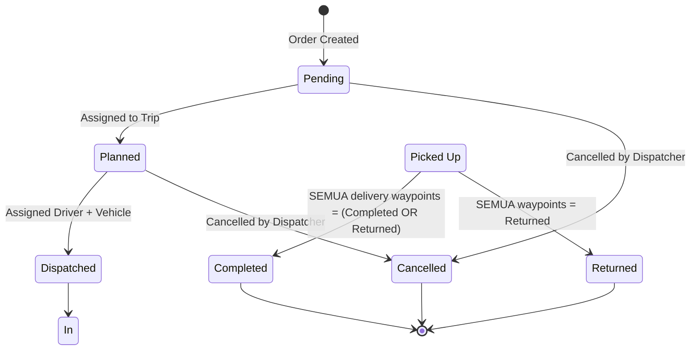
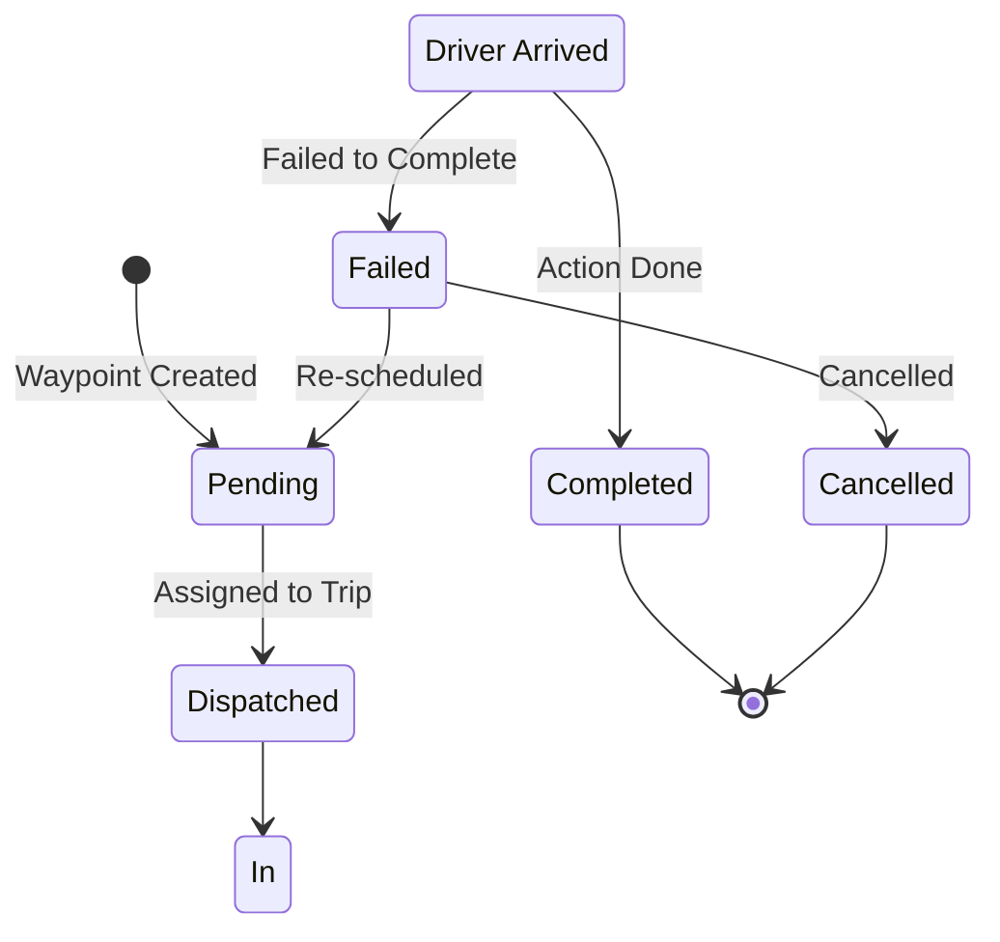
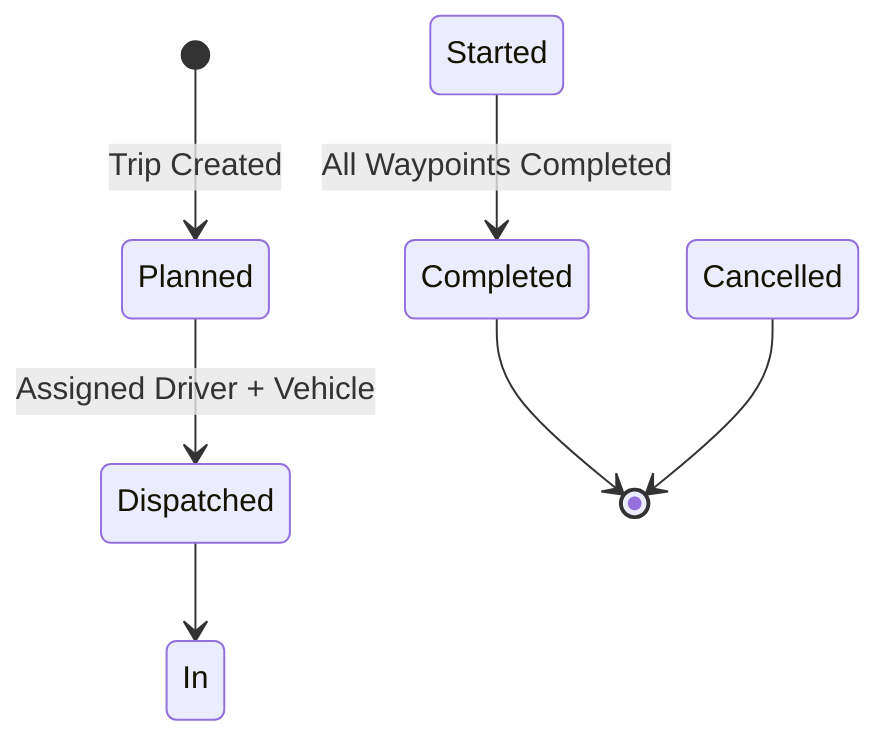

# Dokumen Requirements - TMS SAAS (Updated)

## Ringkasan Proyek

**Nama Proyek:** Transportation Management System (TMS) SAAS
**Target Pengguna:** Perusahaan Logistik Kecil (3PL & Carrier)
**Cakupan Geografis:** Domestik
**Arsitektur:** Monolith dengan Dukungan Multi-tenant
**Customer Tracking:** Public tracking page (tanpa login)

---

## 1. Requirements Bisnis

### 1.1 Target Pengguna

| Peran          | Deskripsi                                      | Tingkat Akses                                |
| -------------- | ---------------------------------------------- | -------------------------------------------- |
| **Admin**      | Manajer perusahaan dengan akses penuh          | Akses penuh ke semua modul                   |
| **Dispatcher** | Staf operasional yang mengelola order dan trip | Manajemen order, direct assignment, tracking |
| **Driver**     | Operator kendaraan yang mengeksekusi trip      | Melihat trip, update status, submit POD      |

### 1.2 Mode Transportasi

| Mode                           | Deskripsi                               | Karakteristik                                                                                                                |
| ------------------------------ | --------------------------------------- | ---------------------------------------------------------------------------------------------------------------------------- |
| **FTL (Full Truck Load)**      | 1 order = 1 trip (truk dedicated)       | Multiple pickup & multiple delivery per order, urutan rute manual (bisa kompleks)                                            |
| **LTL (Less Than Truck Load)** | 1 order = 1 trip (tidak terkonsolidasi) | Multiple pickup & multiple delivery per order, direct assignment fleksibel (tidak bisa split ke multiple trips di phase ini) |

### 1.3 Struktur Order

**Order menggunakan struktur Waypoint (Gabungan Pickup & Delivery):**

```
Order (FTL/LTL)
├── Basic Info
│   ├── Order Number (auto-generated)
│   ├── Customer (shipper & consignee)
│   ├── Order Type: FTL / LTL
│   ├── Reference Code (opsional)
│   ├── Total Price (auto-sum dari delivery waypoints)
│   └── Manual Override Price (opsional, khusus FTL)
│
├── Waypoints (Gabungan Pickup & Delivery)
│   ├── Waypoint 1:
│   │   ├── Type: Pickup / Delivery
│   │   ├── Location: Pilih dari saved addresses customer atau buat baru
│   │   ├── Address, Contact, Date/Time
│   │   ├── Price: (hanya untuk Delivery)
│   │   ├── Weight (opsional - auto-calculate dari items)
│   │   ├── Items: Wajib untuk Delivery, Opsional untuk Pickup
│   │   └── Dispatch Status: Pending / Dispatched / In Transit / Completed / Failed / Returned
│   ├── Waypoint 2:
│   │   ├── Type: Pickup / Delivery
│   │   ├── Location: Pilih dari saved addresses customer atau buat baru
│   │   ├── Address, Contact, Date/Time
│   │   ├── Price: (hanya untuk Delivery)
│   │   ├── Weight (opsional - auto-calculate dari items)
│   │   ├── Items: Wajib untuk Delivery, Opsional untuk Pickup
│   │   └── Dispatch Status: Pending / Dispatched / In Transit / Completed / Failed / Returned
│   └── ...
│
└── Special Instructions (text)
```

**Catatan:** Untuk setiap waypoint, dispatcher dapat memilih alamat dari saved addresses customer atau membuat alamat baru on-the-fly jika diperlukan.

### 1.4 Perbedaan FTL vs LTL

| Aspek                 | FTL                                                           | LTL                                                                    |
| --------------------- | ------------------------------------------------------------- | ---------------------------------------------------------------------- |
| **Order per Trip**    | 1 order                                                       | 1 order                                                                |
| **Customer per Trip** | 1 customer                                                    | 1 customer                                                             |
| **Pickup Points**     | Multiple (1 atau lebih)                                       | Multiple (1 atau lebih)                                                |
| **Delivery Points**   | Multiple (1 atau lebih)                                       | Multiple (1 atau lebih)                                                |
| **Route**             | Urutan manual (bisa kompleks)                                 | Urutan manual (simple)                                                 |
| **Order Gagal**       | Trip gagal total                                              | Waypoint gagal, waypoint lain lanjut                                   |
| **Items**             | Per delivery waypoint (wajib), Per pickup waypoint (opsional) | Per delivery waypoint (wajib), Per pickup waypoint (opsional)          |
| **Urutan Waypoint**   | Ditentukan SAAT ORDER dibuat, TIDAK bisa diubah               | Ditentukan SAAT ASSIGN DRIVER, SUDAH final                             |
| **Display Waypoint**  | Urutkan berdasarkan sequence                                  | Urutkan berdasarkan created_at sebelum assign, sequence setelah assign |

### 1.5 Aturan Direct Assignment

**Catatan:** Module "Perencanaan & Dispatch" dihapus dan digantikan dengan "Direct Assignment" untuk mempercepat MVP.

- **Direct Assignment:** Langsung assign driver + vehicle ke order
- **FTL:** Assign driver + vehicle (urutan waypoint sudah dari order)
- **LTL:** Assign driver + vehicle + SET URUTAN waypoint manual
- **Trip Creation:** 1 order = 1 trip (tidak ada konsolidasi)
- **Trip Status:** Planned → Dispatched saat assign driver

### 1.6 Model Pricing

- **Pricing Matrix Per-Customer:** Setiap customer punya pricing sendiri berdasarkan origin → destination
- **Price Per Delivery Waypoint:** Setiap delivery waypoint punya harga sendiri
- **Total Order Price:** Auto-sum dari semua harga delivery waypoint
- **Tidak ada Manual Override:** Tidak ada diskon/volume-based pricing untuk phase ini

**Contoh Pricing Matrix:**

| Origin  | Destination | Harga        |
| ------- | ----------- | ------------ |
| Jakarta | Bandung     | Rp 500.000   |
| Jakarta | Cirebon     | Rp 750.000   |
| Jakarta | Semarang    | Rp 1.000.000 |

### 1.7 Penanganan Exception (Waypoint-Level)

**Catatan:** Exception handling menggunakan pendekatan Waypoint-Level Failure.

| Tipe Exception       | Deskripsi                                      | Penanganan                                                       |
| -------------------- | ---------------------------------------------- | ---------------------------------------------------------------- |
| **Gagal Pickup**     | Tidak bisa mengambil barang di lokasi pickup   | Re-schedule manual oleh dispatcher, notifikasi email ke customer |
| **Gagal Delivery**   | Tidak bisa mengantar barang di lokasi delivery | Re-schedule manual oleh dispatcher, notifikasi email ke customer |
| **Return to Origin** | Barang dikembalikan ke origin                  | Update status waypoint menjadi "Returned"                        |
| **Delay**            | Trip tertunda                                  | Driver lapor issue, dispatcher diinformasikan                    |
| **Breakdown**        | Kendaraan rusak                                | Driver lapor issue, dispatcher diinformasikan                    |

**Penanganan Exception (Waypoint-Level):**

- **Gagal Waypoint:** Hanya waypoint yang gagal yang di-mark failed
- **Waypoint Lain:** Bisa lanjut eksekusi
- **Re-schedule:** Create new trip HANYA untuk waypoint yang failed
- **Return to Origin:** Driver selesaikan trip dulu, lalu submit POD untuk return

### 1.8 Aturan Notifikasi

| Scenario        | Penerima             | Template         |
| --------------- | -------------------- | ---------------- |
| Order Delivered | Customer (consignee) | delivery_success |
| Gagal Delivery  | Customer (consignee) | failed_delivery  |

**Catatan:** Tidak ada notifikasi untuk Order Created, Order Assigned, Trip Started, Failed Pickup.

### 1.9 POD (Proof of Delivery)

- **Per Delivery Waypoint:** POD dikirim per delivery waypoint
- **Digital Signature:** Wajib
- **Foto:** Wajib
- **Delivery Notes:** Opsional
- **Nama Penerima:** Di-input oleh driver saat submit POD (disimpan di pods.recipient_name)

---

## 2. Requirements Fungsional

### 2.1 Module 1: Manajemen Perusahaan

| Requirement            | Deskripsi                                |
| ---------------------- | ---------------------------------------- |
| Registrasi Perusahaan  | Self-service company registration        |
| Tipe Perusahaan        | Pilih tipe perusahaan: 3PL / Carrier     |
| Konfigurasi Dasar      | Konfigurasi timezone, currency, language |
| Isolasi Per-Perusahaan | Isolasi data per company                 |

### 2.2 Module 2: Manajemen Pengguna & Peran

| Requirement             | Deskripsi                                     |
| ----------------------- | --------------------------------------------- |
| Pembuatan Pengguna      | Buat pengguna per company                     |
| Penugasan Peran         | Assign peran: Admin, Dispatcher, Driver       |
| RBAC Sederhana          | Role-based access control                     |
| Autentikasi             | Autentikasi email/password                    |
| Preferensi Multi-Bahasa | Pengguna bisa pilih bahasa preferensi (ID/EN) |

### 2.3 Module 3: Manajemen Master Data

| Requirement                  | Deskripsi                                                                                |
| ---------------------------- | ---------------------------------------------------------------------------------------- |
| Manajemen Lokasi             | Kelola lokasi pickup/delivery dengan address dan contact                                 |
| Manajemen Customer           | Kelola data shipper & consignee, email                                                   |
| Multiple Customer Addresses  | Setiap customer dapat memiliki multiple alamat (pickup/delivery locations) yang disimpan |
| Pricing Matrix               | Pricing matrix per-customer (origin → destination)                                       |
| Manajemen Kendaraan          | Kelola tipe truk, nomor plat, kapasitas                                                  |
| Manajemen Driver             | Kelola profil driver, license, contact                                                   |

### 2.4 Module 4: Manajemen Order

| Requirement              | Deskripsi                                                                      |
| ------------------------ | ------------------------------------------------------------------------------ |
| Buat Order               | Buat order baru (FTL/LTL)                                                      |
| Pilih Alamat Customer     | Pilih alamat dari saved addresses customer atau buat alamat baru on-the-fly    |
| Multiple Pickup Points   | Support multiple pickup waypoints per order                                    |
| Multiple Delivery Points | Support multiple delivery waypoints per order                                  |
| Items Per Delivery       | Items wajib untuk delivery waypoints                                           |
| Items Per Pickup         | Items opsional untuk pickup waypoints                                          |
| Kalkulasi Harga          | Auto-calculate dari pricing matrix (sum semua delivery waypoint prices)        |
| Reference Code           | Field reference code opsional                                                  |
| Special Instructions     | Field text untuk special handling instructions                                 |
| Lihat Orders             | List semua orders dengan filter                                                |
| Edit Order               | Edit detail order (sebelum assign)                                             |
| Cancel Order             | Cancel order (hanya sebelum assign driver, perlu alasan cancel)                |
| Lifecycle Status Order   | Pending → Planned → Dispatched → In Transit → Completed / Cancelled / Returned |

**Fitur Multiple Customer Addresses:**

Setiap customer dapat memiliki multiple alamat yang disimpan dalam sistem untuk mempercepat proses pembuatan order:

| Fitur                          | Deskripsi                                                                                                           |
| ------------------------------ | ------------------------------------------------------------------------------------------------------------------- |
| Saved Addresses                | Customer dapat memiliki multiple alamat (pickup/delivery locations) yang disimpan                                 |
| Pilih dari Saved Addresses     | Saat membuat order, dispatcher dapat memilih alamat dari daftar saved addresses customer                           |
| Buat Alamat On-the-Fly        | Dispatcher dapat membuat alamat baru langsung saat create order jika alamat yang dibutuhkan belum tersedia        |
| Alamat Default Customer        | Field `address` di tabel `customers` tetap dipertahankan sebagai alamat default/headquarter customer                |
| Tipe Alamat                    | Setiap alamat customer dapat ditandai sebagai pickup location, delivery location, atau keduanya                    |
| Manajemen Alamat               | Admin dapat menambah, mengedit, dan menghapus alamat customer melalui module Master Data                           |

### 2.5 Module 5: Direct Assignment

| Requirement            | Deskripsi                                                             |
| ---------------------- | --------------------------------------------------------------------- |
| Buat Trip              | Buat trip baru dan assign vehicle & driver                            |
| Pilih Waypoints        | Pilih waypoints dari orders pending                                   |
| Direct Assignment      | Langsung assign driver + vehicle ke order                             |
| Urutan Rute Manual FTL | Urutan waypoint ditentukan saat order dibuat, TIDAK bisa diubah       |
| Urutan Rute Manual LTL | Dispatcher set urutan waypoint manual saat assign driver, SUDAH final |
| Pemilihan Kendaraan    | Pemilihan kendaraan manual oleh dispatcher                            |
| Lihat Trips Aktif      | List semua trips aktif                                                |
| Lifecycle Status Trip  | Planned → Dispatched (saat assign driver) → In Transit → Completed    |

### 2.6 Module 6: Driver Web

| Requirement                | Deskripsi                                                          |
| -------------------------- | ------------------------------------------------------------------ |
| Trip Saya                  | Lihat trips yang di-assign (hanya online)                          |
| Lihat Waypoints            | Lihat semua waypoints per trip                                     |
| Lihat Items Per Delivery   | Lihat items untuk setiap delivery waypoint                         |
| Update Status Per Waypoint | Driver update status untuk setiap waypoint                         |
| Lapor Issue                | Driver bisa lapor issues (delay, breakdown, dll)                   |
| Submit POD                 | Submit POD per delivery waypoint dengan digital signature dan foto |
| Status Trip                | Pending → In Transit → Completed                                   |

### 2.7 Module 7: Manajemen Exception

| Requirement               | Deskripsi                                                                                           |
| ------------------------- | --------------------------------------------------------------------------------------------------- |
| Lihat Orders Exception    | List semua orders yang gagal/dikembalikan                                                           |
| Lihat Waypoints Exception | List semua waypoints yang gagal                                                                     |
| Re-schedule Manual        | Dispatcher bisa re-schedule waypoints yang gagal (create new trip HANYA untuk waypoint yang failed) |
| Riwayat Exception         | Lihat riwayat exceptions                                                                            |
| Laporan Exception         | Generate laporan exception                                                                          |

### 2.8 Module 8: Layanan Notifikasi

| Requirement               | Deskripsi                                                                  |
| ------------------------- | -------------------------------------------------------------------------- |
| Email Saat Delivery       | Kirim email ke customer saat delivery waypoint selesai                     |
| Email Saat Gagal Delivery | Kirim email ke customer saat delivery gagal                                |
| Template Multi-Bahasa     | Template email dalam ID dan EN                                             |
| Public Tracking Page      | Halaman publik untuk tracking order berdasarkan order number (tanpa login) |

**Catatan:** Tidak ada notifikasi untuk Order Created, Order Assigned, Trip Started, Failed Pickup.

### 2.9 Module 9: Dashboard Dasar

| Requirement       | Deskripsi                          |
| ----------------- | ---------------------------------- |
| Orders Hari Ini   | Tampilkan jumlah orders hari ini   |
| Trips Aktif       | Tampilkan jumlah trips aktif       |
| Waypoints Pending | Tampilkan jumlah waypoints pending |
| Trips Selesai     | Tampilkan jumlah trips selesai     |

### 2.10 Module 10: Laporan Sederhana

| Requirement       | Deskripsi                                             |
| ----------------- | ----------------------------------------------------- |
| Ringkasan Order   | Laporan orders berdasarkan status, tipe, tanggal      |
| Ringkasan Trip    | Laporan trips berdasarkan status, tanggal             |
| Laporan Revenue   | Laporan revenue berdasarkan range tanggal             |
| Laporan Exception | Laporan exceptions                                    |
| Performa Driver   | Laporan performa driver (trips selesai, on-time rate) |
| Export Excel      | Semua laporan bisa di-export ke Excel format          |

### 2.11 Module 11: Multi-bahasa (i18n)

| Requirement    | Deskripsi                             |
| -------------- | ------------------------------------- |
| File Bahasa    | File JSON untuk translations (ID, EN) |
| Pemilih Bahasa | Pengguna bisa switch bahasa           |
| Auto-Detect    | Auto-detect bahasa browser            |

### 2.12 Module 12: Wizard Onboarding

| Requirement               | Deskripsi                  |
| ------------------------- | -------------------------- |
| Step 1: Profil Perusahaan | Setup informasi perusahaan |
| Step 2: Tambah Pengguna   | Tambah pengguna awal       |
| Step 3: Tambah Kendaraan  | Tambah kendaraan           |
| Step 4: Tambah Driver     | Tambah driver              |
| Step 5: Setup Pricing     | Setup pricing matrix       |
| Opsi Skip                 | Pengguna bisa skip wizard  |

### 2.13 Module 13: Audit Trail

| Requirement                   | Deskripsi                                                                |
| ----------------------------- | ------------------------------------------------------------------------ |
| Order History untuk Tracking  | Menyimpan history status order untuk ditampilkan di Public Tracking Page |
| Waypoint Logs                 | Menyimpan log perubahan status waypoint untuk tracking                   |
| Event Types                   | OrderCreated, StatusChange (mencatat semua status termasuk Failed)       |
| Tidak ada User Action Logging | Tidak mencatat log aksi user (login, logout, dll)                        |

**Catatan:** Audit trail hanya untuk keperluan tracking customer di Public Tracking Page, bukan untuk audit keamanan atau compliance.

### 2.14 Module 14: Public Tracking Page

| Requirement                       | Deskripsi                                                           |
| --------------------------------- | ------------------------------------------------------------------- |
| Tracking Berdasarkan Order Number | Customer bisa tracking order dengan memasukkan order number         |
| Tanpa Login                       | Halaman publik, tidak perlu login                                   |
| Tampilkan Status Order            | Menampilkan status order saat ini                                   |
| Tampilkan History Waypoint        | Menampilkan riwayat waypoint dari waypoint_logs (pickup/delivery)   |
| Tampilkan POD                     | Menampilkan POD jika sudah selesai (termasuk foto & signature)      |
| Tampilkan Nama Penerima           | Menampilkan nama penerima dari pods.recipient_name                  |
| Tampilkan Driver & Vehicle Info   | Menampilkan nama driver dan info vehicle (hanya nama untuk privacy) |
| Multi-Bahasa                      | Support bahasa ID dan EN                                            |

**Catatan:** Untuk tracking history waypoint, hanya menggunakan data dari tabel `waypoint_logs` yang mencatat perubahan status waypoint.

---

## 3. Requirements Non-Fungsional

### 3.1 Performa

| Requirement         | Deskripsi                                     |
| ------------------- | --------------------------------------------- |
| Waktu Response      | Waktu response API < 500ms untuk 95% requests |
| Pengguna Concurrent | Support 100 pengguna concurrent per company   |
| Database            | Query teroptimasi dengan indexing yang tepat  |

### 3.2 Skalabilitas

| Requirement        | Deskripsi                                      |
| ------------------ | ---------------------------------------------- |
| Multi-Tenant       | Support multiple companies dengan isolasi data |
| Horizontal Scaling | Arsitektur support horizontal scaling          |
| Database Scaling   | PostgreSQL dengan connection pooling           |

### 3.3 Keamanan

| Requirement       | Deskripsi                        |
| ----------------- | -------------------------------- |
| Autentikasi       | Autentikasi berbasis JWT         |
| Otorisasi         | Role-based access control (RBAC) |
| Isolasi Data      | Isolasi data per-company         |
| Enkripsi Password | Hashing Bcrypt untuk passwords   |
| HTTPS             | Semua komunikasi melalui HTTPS   |

### 3.4 Ketersediaan

| Requirement       | Deskripsi                 |
| ----------------- | ------------------------- |
| Uptime            | Target uptime 99.5%       |
| Backup            | Backup database harian    |
| Disaster Recovery | Rencana pemulihan bencana |

### 3.5 Keusabilitas

| Requirement      | Deskripsi                           |
| ---------------- | ----------------------------------- |
| Desain Responsif | UI mobile-friendly untuk driver app |
| UI Intuitif      | Interface sederhana dan intuitif    |
| Multi-Bahasa     | Support bahasa ID dan EN            |

---

## 4. Requirements Teknis

### 4.1 Teknologi Stack

| Layer         | Teknologi    |
| ------------- | ------------ |
| **Backend**   | Golang       |
| **Frontend**  | React + Vite |
| **Styling**   | Tailwind CSS |
| **Database**  | PostgreSQL   |
| **Audit Log** | MongoDB      |
| **Cache**     | Redis        |
| **Email**     | SMTP         |

### 4.2 Arsitektur

```
┌─────────────────────────────────────────────────┐
│ Frontend                                            │
│ ├── Portal Admin/Dispatcher (React + Vite + Tailwind) │
│ └── Driver Mobile Web (React + Vite + Tailwind)   │
└─────────────────────────────────────────────────┘
                        ↓
┌─────────────────────────────────────────────────┐
│ Backend (Monolith - Golang + Clean Architecture)     │
│ ├── Auth Service                                     │
│ ├── Company Service                                   │
│ ├── User Service                                     │
│ ├── Master Data Service                               │
│ ├── Order Service                                    │
│ ├── Direct Assignment Service                           │
│ ├── Notification Service                               │
│ ├── Report Service                                    │
│ └── i18n Service                                    │
└─────────────────────────────────────────────────┘
                        ↓           ↓
┌─────────────────────────────────────────────────┐
│ Databases                                           │
│ ├── PostgreSQL (Multi-tenant)                         │
│ ├── MongoDB (Audit Log)                              │
│ └── Redis (Cache & Session)                         │
└─────────────────────────────────────────────────┘
```

### 4.3 Prinsip Desain Database

| Prinsip      | Deskripsi                                            |
| ------------ | ---------------------------------------------------- |
| Multi-Tenant | Isolasi data per-company menggunakan company_id      |
| Indexing     | Indexing yang tepat untuk fields yang sering diquery |
| Transactions | Kepatuhan ACID untuk operasi kritis                  |
| Soft Delete  | Gunakan deleted_at alih-alih hard delete             |

### 4.4 Pendekatan Desain Database (MVP)

Untuk MVP, menggunakan pendekatan **Single Table Combined** dengan tambahan tabel `waypoint_logs` untuk tracking:

| Tabel Utama       | Deskripsi                                    |
| ----------------- | -------------------------------------------- |
| `orders`          | Data order utama                             |
| `order_waypoints` | Data waypoints per order                     |
| `waypoint_items`  | Items per waypoint (disimpan sebagai JSON)   |
| `pods`            | Data POD per delivery waypoint               |
| `trips`           | Data trip (perjalanan fisik)                 |
| `waypoint_logs`   | Log perubahan status waypoint untuk tracking |

**Keuntungan Single Table Combined:**

- Struktur sederhana
- JOIN lebih sedikit
- Query lebih cepat
- Cocok untuk MVP

**Tabel `waypoint_logs` digunakan untuk:**

- Tracking history waypoint di Public Tracking Page
- Audit trail perubahan status waypoint
- Event types: OrderCreated, StatusChange (mencatat semua status termasuk Failed)

**Simplifikasi MVP:**

- **Dispatch table dihapus** - Trip menjadi single source of truth untuk assignment & execution
- 1 Order = 1 Trip (1:1 relationship)
- Untuk future multi-order consolidation, dispatch table dapat ditambahkan kembali

---

## 5. Prioritas Modul

| Prioritas | Modul                  | Deskripsi                                             |
| --------- | ---------------------- | ----------------------------------------------------- |
| **P0**    | Company Management     | Foundation multi-tenant                               |
| **P0**    | User & Role Management | Auth & RBAC                                           |
| **P0**    | Master Data Management | Location, Customer, Vehicle, Driver, Pricing Matrix   |
| **P0**    | Order Management       | Buat & kelola orders                                  |
| **P0**    | Direct Assignment      | Assign driver + vehicle (+ urutan LTL), trip creation |
| **P0**    | Driver Web             | Operasi driver                                        |
| **P0**    | Exception Management   | Handle orders gagal                                   |
| **P1**    | Notification Service   | Notifikasi email (Failed Delivery, Delivered)         |
| **P1**    | Basic Dashboard        | Ringkasan                                             |
| **P1**    | Simple Reports         | Analitik + Excel export                               |
| **P1**    | Multi-language (i18n)  | Lokalisasi                                            |
| **P1**    | Public Tracking Page   | Halaman publik tracking order (tanpa login)           |
| **P2**    | Audit Trail            | Order history untuk customer tracking                 |
| **P2**    | Onboarding Wizard      | Setup cepat                                           |

**Modul yang DIHAPUS:**

- ~~Perencanaan & Dispatch~~ (digantikan Direct Assignment)

---

## 6. Batasan & Asumsi

### 6.1 Batasan

| Batasan             | Deskripsi                                              |
| ------------------- | ------------------------------------------------------ |
| Pembatalan Order    | Tidak bisa cancel order setelah assign driver          |
| Driver App          | Hanya online (tanpa kemampuan offline)                 |
| Optimasi Rute       | Manual oleh dispatcher (tanpa auto-optimisasi di MVP)  |
| Pemilihan Kendaraan | Manual oleh dispatcher (tanpa auto-seleksi di MVP)     |
| Integrasi           | Tidak ada integrasi eksternal di MVP                   |
| Hub Operations      | Tidak ada hub operations (transit, hub arrival) di MVP |

### 6.2 Asumsi

| Asumsi                    | Deskripsi                                             |
| ------------------------- | ----------------------------------------------------- |
| Perusahaan Logistik Kecil | Target pengguna memiliki kemampuan IT terbatas        |
| Operasi Domestik          | Semua operasi dalam batas negara                      |
| Single Pickup untuk LTL   | Order LTL biasanya punya single pickup (gudang pusat) |
| Notifikasi Email          | Customer punya alamat email yang valid                |

---

## 7. Peningkatan Masa Depan (Di Luar Scope MVP)

| Fitur                  | Deskripsi                                       |
| ---------------------- | ----------------------------------------------- |
| Optimasi Rute Otomatis | Optimasi rute berbasis algoritma                |
| GPS Real-Time Tracking | Tracking kendaraan real-time via GPS            |
| Partial Delivery       | Support untuk scenario partial delivery         |
| Integrasi Eksternal    | Konektor ERP/CRM                                |
| Aplikasi Mobile Native | Aplikasi driver native iOS/Android              |
| Mode Offline           | Kemampuan offline untuk driver app              |
| Analitik Lanjutan      | Dashboard business intelligence                 |
| Portal Customer        | Portal self-service untuk customer              |
| WhatsApp/SMS           | Notifikasi via WhatsApp/SMS untuk status update |
| Hub Operations         | Transit dan Hub Arrival tracking                |

---

## 8. Glossarium

| Istilah          | Definisi                                                                 |
| ---------------- | ------------------------------------------------------------------------ |
| **FTL**          | Full Truck Load - 1 order menggunakan 1 truk secara eksklusif            |
| **LTL**          | Less Than Truck Load - 1 order menggunakan 1 truk (tidak terkonsolidasi) |
| **Waypoint**     | Titik perhentian dalam perjalanan (pickup atau delivery)                 |
| **Trip**         | Perjalanan dengan kendaraan + driver + orders (juga disebut Shipment)    |
| **Order**        | Permintaan pengiriman dari customer                                      |
| **POD**          | Proof of Delivery - Bukti bahwa barang telah dikirim                     |
| **Dispatcher**   | Staf operasional yang melakukan direct assignment ke driver              |
| **3PL**          | Third Party Logistics - Penyedia layanan logistik                        |
| **Carrier**      | Perusahaan yang memiliki kendaraan dan mengangkut barang                 |
| **Multi-Tenant** | Arsitektur yang support multiple companies dengan isolasi data           |

---

## 9. Lampiran

### 9.1 Lifecycle Status Order



**Catatan:**

- Status "Delivered" DIHAPUS
- Order Completed: SEMUA delivery waypoints status = (Completed OR Returned)
- Order Returned: SEMUA waypoints status = Returned

### 9.2 Lifecycle Status Waypoint



### 9.3 Lifecycle Status Trip



**Catatan:**

- Trip status TIDAK berubah ke "Failed" jika waypoint gagal
- Trip tetap "In Transit" sampai semua waypoints di trip itu selesai

### 9.4 Contoh Flow FTL

```
Order #001 (FTL)
├── Waypoint 1: Pickup Jakarta - sequence=1 (diisi saat create)
├── Waypoint 2: Delivery Bandung - sequence=2 (diisi saat create)
├── Waypoint 3: Delivery Cirebon - sequence=3 (diisi saat create)
└── Waypoint 4: Delivery Semarang - sequence=4 (diisi saat create)

Assign Driver + Vehicle:
├── Trip #T001 dibuat (status: Planned → Dispatched)
├── Order status: Pending → Planned → Dispatched
└── Waypoint sequence: TIDAK bisa diubah (final saat create)
```

### 9.5 Contoh Flow LTL

```
Order #002 (LTL)
├── Waypoint 1: Pickup Jakarta - sequence=NULL (belum ada)
├── Waypoint 2: Delivery Bandung - sequence=NULL (belum ada)
├── Waypoint 3: Delivery Cirebon - sequence=NULL (belum ada)
└── Waypoint 4: Delivery Semarang - sequence=NULL (belum ada)

Display sebelum assign: Urutkan berdasarkan created_at

Assign Driver + Vehicle + SET URUTAN:
├── Trip #T001 dibuat (status: Planned → Dispatched)
├── Order status: Pending → Planned → Dispatched
├── Waypoint 1: sequence=1
├── Waypoint 3: sequence=2 (dispatcher set manual)
├── Waypoint 2: sequence=3 (dispatcher set manual)
└── Waypoint 4: sequence=4 (dispatcher set manual) - SUDAH FINAL
```

### 9.6 Contoh Exception Handling (Waypoint-Level)

```
Order #003 (In Transit)
├── Waypoint 1: Pickup Jakarta - Completed
├── Waypoint 2: Delivery Bandung - Completed
├── Waypoint 3: Delivery Cirebon - FAILED ❌
└── Waypoint 4: Delivery Semarang - Pending

Dispatcher putuskan untuk Waypoint 3:
├── Opsi A: Re-schedule
│   ├── Waypoint 3 status: Failed → Pending
│   ├── reschedule_count: 1
│   ├── Create Trip #T002 (HANYA untuk Waypoint 3)
│   └── Trip #T001 tetap "In Transit" (lanjut ke Waypoint 4)
│
└── Opsi B: Return to Origin
    ├── Waypoint 3 status: Failed → Returned
    ├── Driver selesaikan Trip #T001 dulu
    ├── Driver submit POD untuk Return to Origin
    └── Trip #T001 tetap "In Transit" (lanjut ke Waypoint 4)
```

### 9.7 Contoh Public Tracking Timeline

```
Order #001 - Status: Completed

Timeline:
━━━━━━━━━━━━━━━━━━━━━━━━━━━━━━━━━━━━━━━━━━━━━━━━━━━
  14 Jan 2026 13:29
  ✓ Order Created: CGK Gateway membuat order pengiriman
  (Source: waypoint_logs, event_type=OrderCreated)

  13 Jan 2026 23:40
  ✓ Pickup Scheduled: Paket telah dijadwalkan untuk dipickup
  (Source: order_waypoints, type=Pickup, status=Pending)

  13 Jan 2026 23:41
  ✓ Pickup Completed: Pengiriman anda berhasil dipickup, barang diterima di (CGK Gateway)
  (Source: waypoint_logs, event_type=StatusChange, status=Completed)

  14 Jan 2026 08:03
  ✓ Delivery Scheduled: Pengiriman telah dijadwalkan untuk menuju lokasi penerima
  (Source: order_waypoints, type=Delivery, status=Pending)

  14 Jan 2026 13:29
  ✓ In Transit: Pengiriman dalam perjalanan menuju lokasi anda
  (Source: waypoint_logs, event_type=StatusChange, status=In Transit)

  14 Jan 2026 13:29
  ✓ Delivered: Pengiriman telah selesai, diterima oleh (Ashraf)
  (Source: waypoint_logs, event_type=StatusChange, status=Completed)
  (Nama penerima dari: pods.recipient_name)

  Driver: Budi
  Vehicle: B 1234 XYZ
━━━━━━━━━━━━━━━━━━━━━━━━━━━━━━━━━━━━━━━━━━━━━━━━━━━
```

---

**Versi Dokumen:** 2.2
**Terakhir Diupdate:** 2026-01-23
**Status:** Final (Updated - Dispatch table dihapus untuk MVP simplification)
